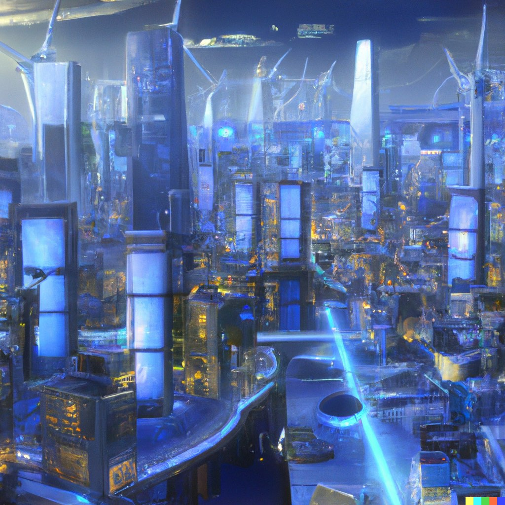
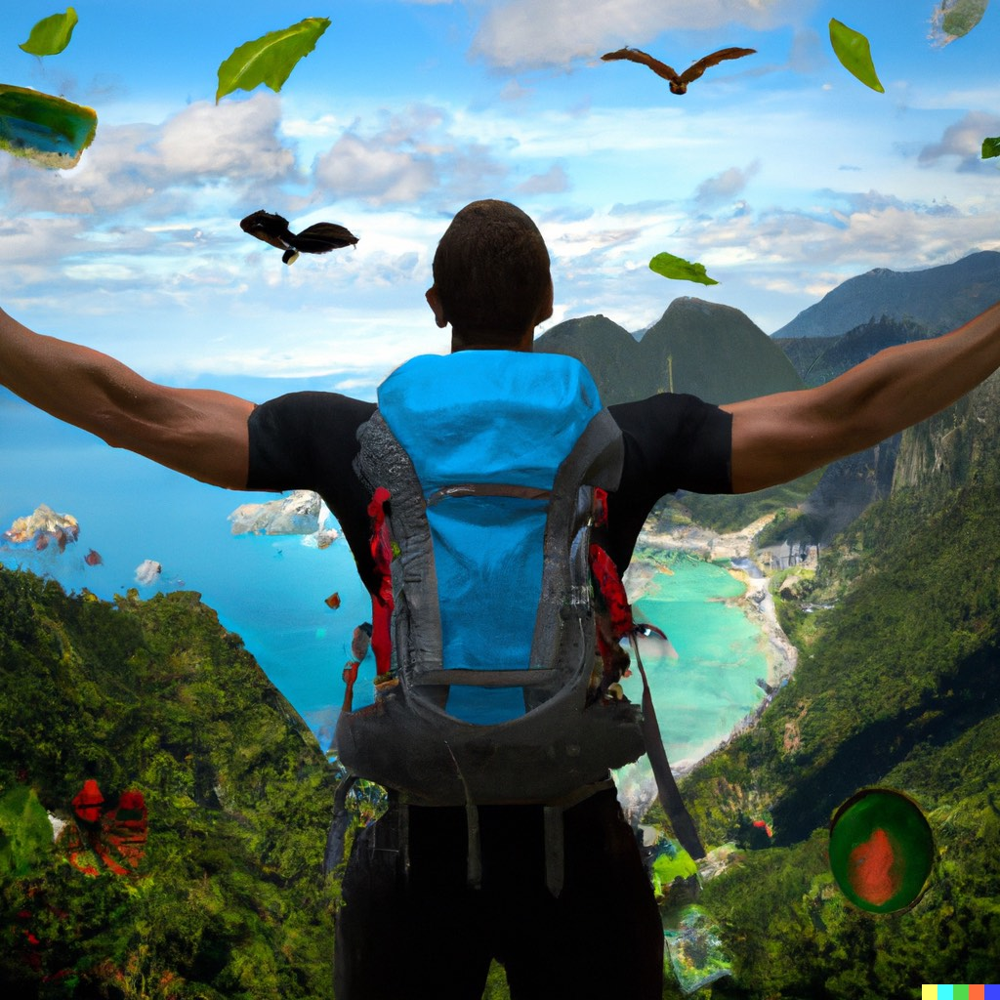

Hi, I am **Toni** and I am an electrical engineer with a deep interest in sustainability and green energy. I study in Aachen, Germany. 🇩🇪 I have a strong interest in the development of smart grid technology and its potential to create a more sustainable future. 💚

<figure>
	
	<figcaption>Photo generated with DALL·E 2</figcaption>
</figure>

I am currently working at a [social startup](i4k.org) that focuses on teaching kids graphic programming. My role is to help match local students with our classes and spread the word about the benefits of our programs. I am proud to be part of an organization that helps to educate young people and inspire the next generation of tech-savvy individuals. 🧑‍💻

<figure>
	
	<figcaption>Photo generated with DALL·E 2</figcaption>
</figure>

My passion for triathlon and nutrition comes from a desire to promote a healthier lifestyle. I have spent many years studying these topics and have gained a deep understanding of the importance of a balanced approach to both physical activity and nutrition. For me, a combination of rigorous exercise and a nutritious diet is essential. Whether it's competing in a triathlon or making healthier choices in everyday life, I am dedicated to spreading awareness about the benefits of an active lifestyle. Through my knowledge and experience, I hope to inspire others to take a similar approach and live a healthier and happier life. 🏃🏻

<figure>
	
	<figcaption>Photo generated with DALL·E 2</figcaption>
</figure>

Besides green energy, I am passionate about exploring new places and expanding my knowledge. On this blog, I will share my experiences from my travels and what I have learned from my studies. Whether it's highlighting the sustainable practices I come across on my travels or sharing my thoughts on the latest developments in green energy and electrical engineering, I will provide a unique and personal perspective. I hope to use this platform to inspire and educate others, and to connect with like-minded individuals who share my interests. Join me on this journey as I explore the world, continue to learn and grow, and share my passions with you. 🚀

<figure>
	
	<figcaption>Photo generated with DALL·E 2</figcaption>
</figure>

Thank you for visiting my blog and I hope you find it informative and thought provoking. Please feel free to contact me with any comments or questions. Let's make a difference together! 🗣️

## What am I doing now?

[See my now page.](../now)