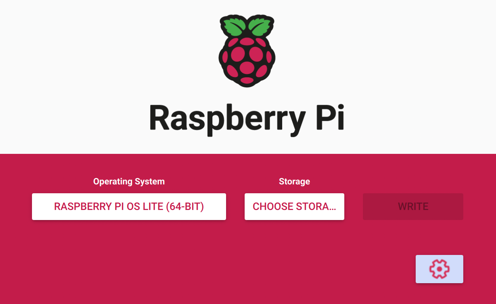

## Why should you care?

Did you ever wonder would be possible to do with a small computer? What could possibly be worth your time to get into programming a Raspberry Pi?

Yeah, me too. Especially all the time that could be necessary to maintain our weekend projects along the way. In last couple of months I used my Raspberry Pi to ease my life as digital nomad! That's why, I want to share with you my journey! 

## Set up

There are great tutorial on the process of setting up a Raspberry Pi. I wanted to keep it simple. So, I used **Raspberry Pi OS**. There's an [official tool](https://www.raspberrypi.com/software/) for creating the SD card. 

Because of my Raspberry Pi 4, I chose the **64 bit** version. I also went with the **lite** version, meaning command line only.

If you want to set further settings like ssh, custom credentials and wireless LAN, click on the gearwheel.

Now, your SD card is ready to go! 🎉

### Connect to your Raspberry Pi

Your Pi boots automatically after powering it. Give it couple of moments!

Meanwhile, let's make sure your ssh connection will run smoothly.

If you'd like to clear old references:

	ssh-keygen -R raspberrypi.local
	
You can connect to your Pi using your chosen credentials:

	ssh username@ip
	e.g.: ssh pi@raspberrypi.local

The default credentials for any raspberry pi running Raspberry Pi OS:

	username: pi
	password: raspberry
	

### Preventing WiFi Dropping

If you want to be on the safe side, you should disable the power management for your wlan on the pi. Open the following file.

	sudo nano /etc/rc.local
	
Insert above the "exit 0" the following: 

	/sbin/iw wlan0 set power_save off
	
### Change credentials and further configuration

If you'd like to change your credentials in the future, just use the raspi-config! There are many more things to tweak as well. Have a look!

	sudo raspi-config

## Conclusion

That was the fast track to get your Raspberry Pi up and running. We'll use this setup for the following topics:

