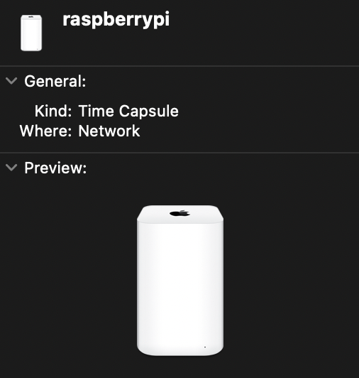
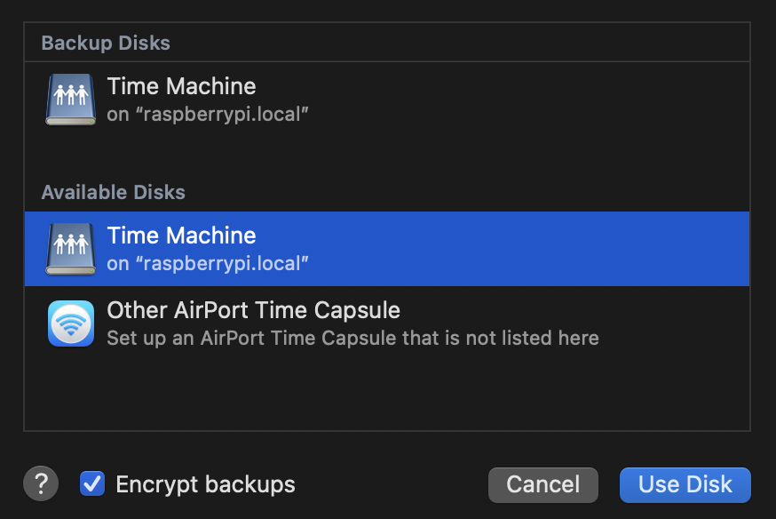
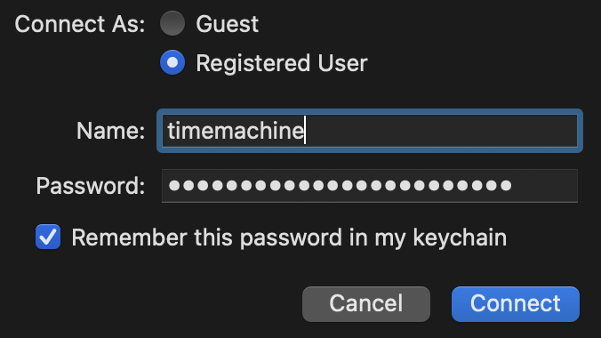

## Setup Raspberry Pi

If you want to read about our basic Raspberry Setup: [Here you go!](https://czyrnik.me/blog/how-to-set-up-a-raspberry-pi/)
	
## Prepare the external drive

The most important thing is going to be your connected hard drive. We need a drive that uses HFS+ or APFS. Otherwise, we cannot use it for Time Machine. Currently, there's only a reliable read-only version for APFS on Linux. So, we are going to use HFS+ instead. 

Please make sure you format your drive correctly and do not forget to give read and write permissions to everyone using "Get Info" on your Mac.

## Mounting our Hard Drive

After we connected your drive to the Pi, we need to mount it. Otherwise we cannot access it. The Format HFS+ is not native to Linux. So, we need to install it.

	sudo apt-get install hfsprogs

After installing it, we need to find the name of our drive.
	
	lsblk -f

The name of my drive is "sda2". You'll find yours looking at the format and the size.

### Creating a Mount Point

Before mounting a drive, we'll need a mount point! Let's create a directory. You can choose the path to your point as you like. I chose "/TM".

	sudo mkdir -p /TM

Let's mount our drive!
	
	sudo mount -t hfsplus -o force,rw /dev/name_of_your_drive /your_mount_point

Unfortunately, the drive is not yet mounted permanently. Let's do that! Let's find the "PARTUUID" of your drive fist. 

	sudo blkid /dev/sda2
	
Let's open the following:

	sudo nano /etc/fstab

Add this line with your "PARTUUID" to the bottom of the file.

	PARTUUID="your_partuuid" /your_mountpoint     hfsplus force,rw,user,auto        0       0

Now, your drive will be mounted after every boot of the Pi! 🤯

## Preparing everything for Time Machine

Before the can access the drive from our Mac, we need couple of additional tweaks.

### Installing Samba and Avahi

Samba is used for the file server. 

Avahi emulates a Time Capsule and our drive get's automatically discovered by MacOS. 🔎

Let's install everything on our Raspberry Pi.

	sudo apt-get install samba avahi-daemon

### Creating a new user on the Pi

Let's add a user "timemachine" for dealing with all our Time Machine stuff! 

	sudo adduser timemachine

After creating the user, you'll be prompted to enter a password for the new user on your Raspberry Pi.

### Configurating Samba

We need to define a password for Samba. I used the same password for convenience.

	sudo smbpasswd -a timemachine

The need to define same details for Samba. "Time Machine" will be the name for our server. 

	sudo nano /etc/samba/smb.conf

Add these lines to end of the file:

	[Time Machine]
		comment = Backups
		path = /your_mount_point
		valid users = timemachine
		read only = no
		vfs objects = catia fruit streams_xattr
		fruit:time machine = yes
 
The changes will be affective after reloading Samba!

	sudo service smbd reload

### Configurating Avahi

Almost done! 🙂

We need to configure Avahi. Lets open the following file:

	sudo nano /etc/avahi/services/samba.service

The need to copy all the following into this file:

	<?xml version="1.0" standalone='no'?><!--*-nxml-*-->
	<!DOCTYPE service-group SYSTEM "avahi-service.dtd">
	<service-group>
	  <name replace-wildcards="yes">%h</name>
	  <service>
	    <type>_smb._tcp</type>
	    <port>445</port>
	  </service>
	  <service>
	    <type>_device-info._tcp</type>
	    <port>9</port>
	    <txt-record>model=TimeCapsule8,119</txt-record>
	  </service>
	  <service>
	    <type>_adisk._tcp</type>
	    <port>9</port>
	    <txt-record>dk0=adVN=Time Machine,adVF=0x82</txt-record>
	    <txt-record>sys=adVF=0x100</txt-record>
	  </service>
	</service-group>

Let's reload the service, so the changes will be affective:

	sudo service avahi-daemon reload

Now, your raspberry should be recognized as a Time Capsule!

Time Machine, here I come! 🚀

## Configuration Time Machine

Your drive should now be detected by the Time Machine. 

Do not forget to encrypt your backups!

You can use the user "timemachine" and the Samba password you chose earlier.

## Conclusion

We've seen how to emulate a Time Capsule using a Raspberry Pi. Due to the small size of the Raspberry Pi, it's a very portable backup solution, which can be taken everywhere!