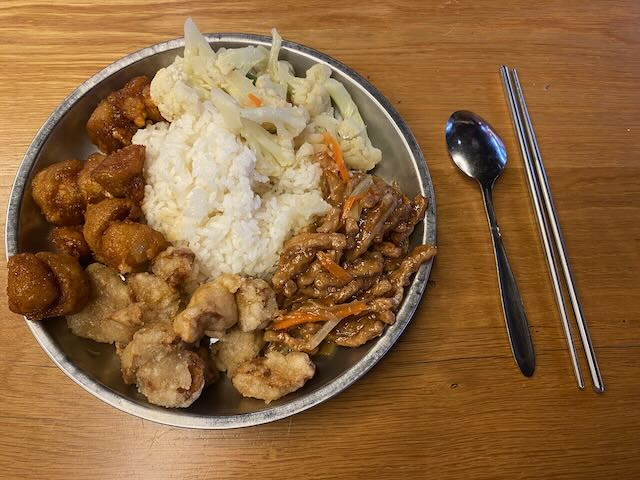

## NTUST

The National University of Science and Technology (NTUST) is one of Taiwan's top universities, known for its strong programs in engineering, computer science, and business. Located in the heart of Taipei, it is a popular destination for students from around the world.

<figure>
	
	<figcaption>Me at NTUST</figcaption>
</figure>

### Facilities on Campus

The campus is designed to provide a convenient and accessible environment for students. With everything within a 5-minute walk, the compact campus is easy to navigate and provides a stress-free atmosphere. The campus is largely car-free, promoting a clean and quiet environment. The NTUST campus is equipped with well-maintained facilities, providing students with a comfortable and supportive environment for their academic and personal growth.

<figure>
	
	<figcaption>Vegetarian Meal from the canteen</figcaption>
</figure>

There is a spacious library offering a wide range of resources and study spaces. The campus offers several student residences, providing a convenient and affordable living option. Unfortunately, on-campus housing is only available to students staying longer than six months.

<figure>
	
	<figcaption>LOUISA Cafe on Campus</figcaption>
</figure>

There are several dining options available on campus, such as cafes, canteens, and restaurants. The whole campus is covered by eduroam, fast internet guaranteed! The dining halls offer a variety of cuisines such as (vegetarian) buffet, Japanese cuisine and noodles & dumplings.

<figure>
	
	<figcaption>Food</figcaption>
</figure>

The campus offers sports facilities, including a free gym, an inexpensive swimming pool, and free playing fields for various sports. There are several student clubs and organizations, providing students with the opportunity to get involved in extracurricular activities and connect with others who share their interests. 

<figure>
	
	<figcaption>Gym</figcaption>
</figure>

### My Study

- 2 courses from NTU and NTUT
