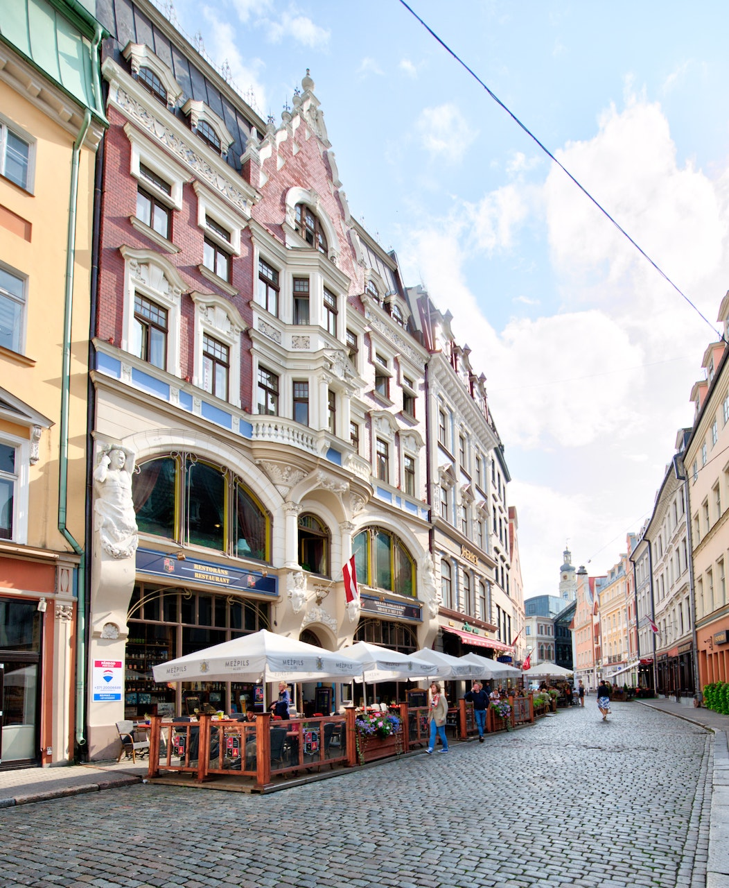
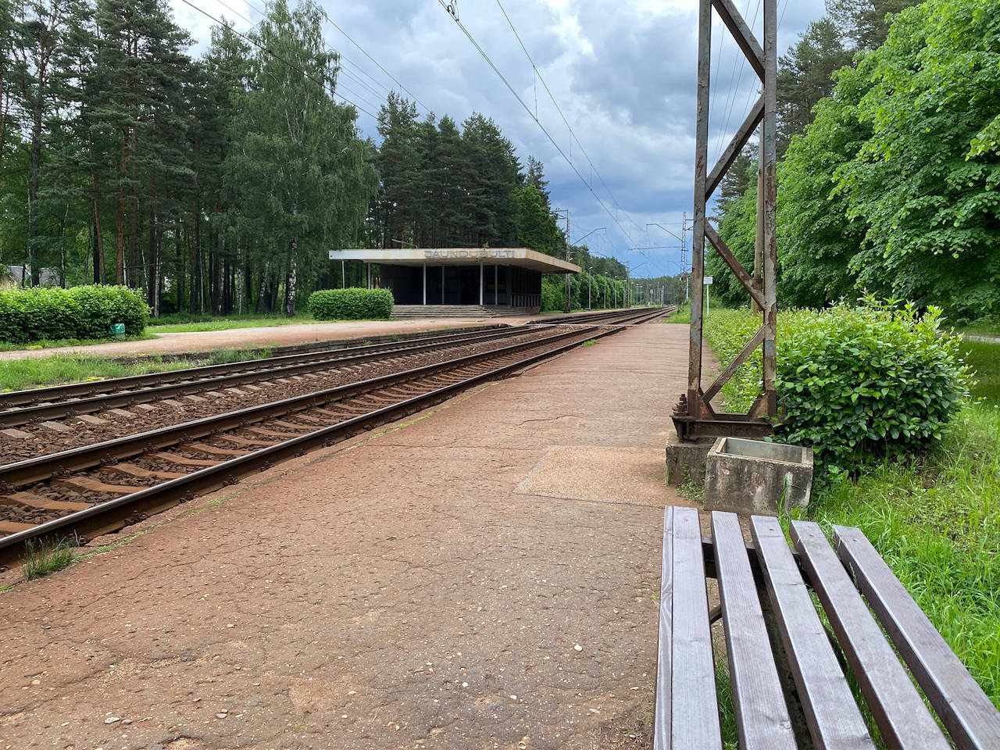
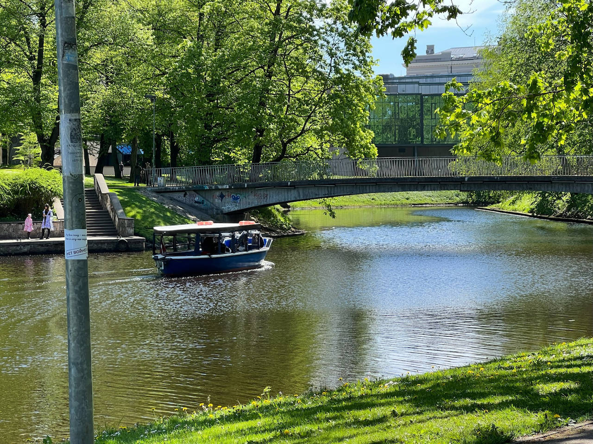

## Welcome to the Baltics - Riga Edition

<figure>
	
	<figcaption>by Gilly</figcaption>
</figure>

### Old Town 

<figure>
	
	<figcaption>by Jacques Bopp</figcaption>
</figure>

## Population

<figure>
	
	<figcaption>Inhabitants in Riga</figcaption>
</figure>

## Public Transport

<figure>
	
	<figcaption></figcaption>
</figure>

## Vegan Community

## Beach

<figure>
	
	<figcaption></figcaption>
</figure>

<figure>
	
	<figcaption></figcaption>
</figure>

## Parks

<figure>
	
	<figcaption></figcaption>
</figure>

<figure>
	
	<figcaption></figcaption>
</figure>

## Conclusion

<figure>
	
	<figcaption></figcaption>
</figure>