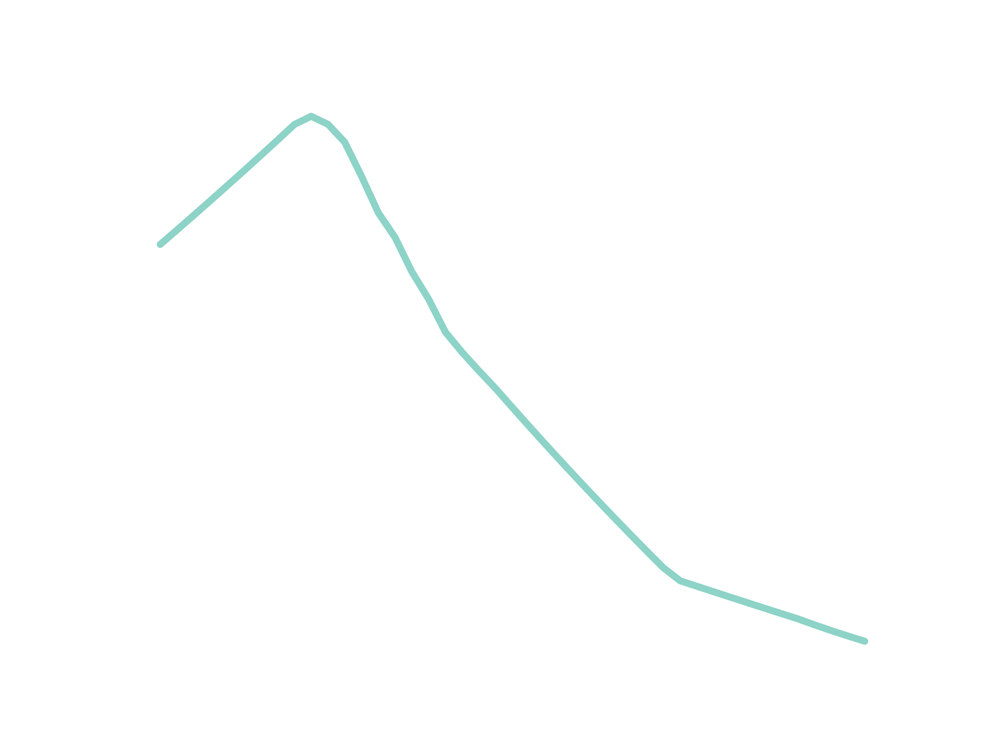

## Welcome to the Baltics - Riga Edition

<figure>
	
	<figcaption>Aerial Shot by Gilly</figcaption>
</figure>

### Old Town 

<figure>
	
	<figcaption>Old Town Vibes by Jacques Bopp</figcaption>
</figure>

## Population

<figure>
	
	<figcaption>Inhabitants in Riga</figcaption>
</figure>

## Public Transport

<figure>
	
	<figcaption>Train Station near the beach</figcaption>
</figure>

## Vegan Community

## Beach

<figure>
	
	<figcaption>Beach near Riga</figcaption>
</figure>

<figure>
	
	<figcaption>Beach near Riga</figcaption>
</figure>

## Parks

<figure>
	
	<figcaption>Tourist Boat in a park</figcaption>
</figure>

<figure>
	
	<figcaption>Flowing Water</figcaption>
</figure>

## Conclusion

<figure>
	
	<figcaption>Me in Riga, June 2022</figcaption>
</figure>