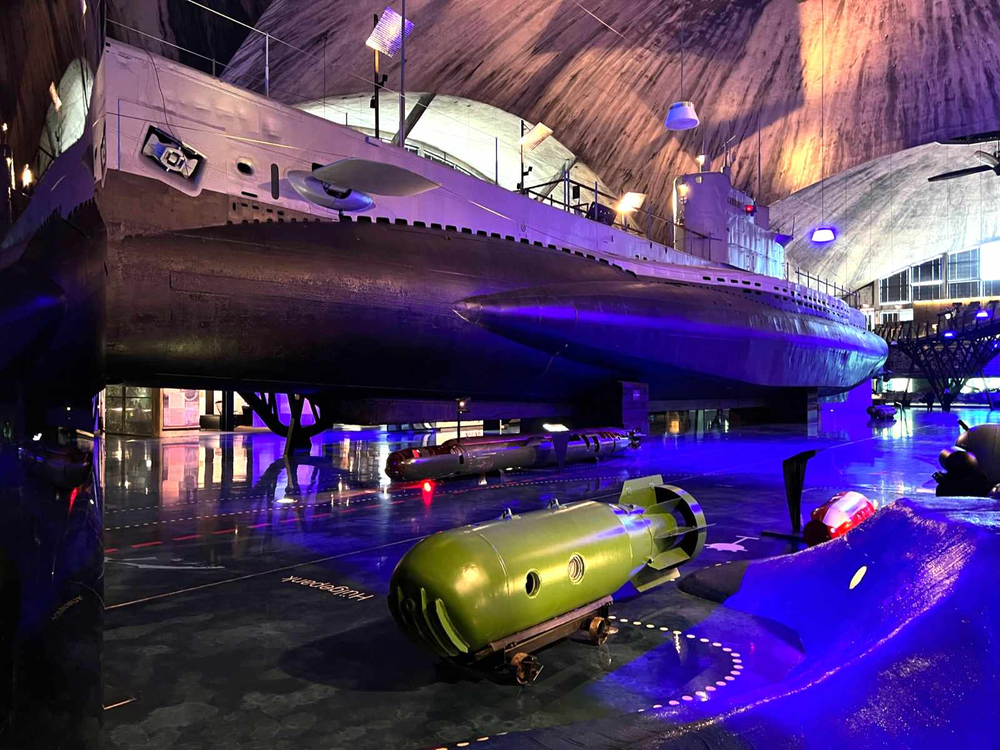

## Welcome to the Baltics

Yes, I chose Tallinn as the first destination as a digital nomad. Tallinn - the tiny capital many never heard of. I think it's one of the most underrated cities in Europe. 🇪🇺

Estonia is the country with the most digital government in Europe. Their ID cards provide digital access for signatures, voting, medical records and submitting tax claims. You can even start your first business digitally. But there are things you need to do in person: marriage, divorce and a credit for properties. 

*IT education is important in Estonia. All children start learning about algorithms and coding at the age of seven. It's designed to be preparation for the digital age.*

<figure>
	
	<figcaption>Small Street in Tallinn Old Town</figcaption>
</figure>

Fun Fact: When you walk around the city, you'll notice the lokal coffeeshops "Reval". That's the original name of the city until 1918. The name changed to Tallinn with the independence of Estonia.

Reval was a significant trade hub in Europe during the 14th and 16th centuries. Today, the old town of Tallinn is one of the best-preserved medieval cities and is classified as a UNESCO World Heritage Site. You get a glimpse of the former medieval fortress.

Tallinn was occupied by the German until end of World War 1. Followed by the occupation by the Red Army during World War 2 in 1940. Nazi Germany occupied the city from 1941 to 1944. But Soviet occupation was quickly reestablished until 1991. Tallinn became the capital of an independent country once again in August 1991. 🎉

## Population

Tallinn experienced an extensive influx of Russian immigrants during the Soviet occupation (1944-1991). Whole new city districts were developed like Lasnamäe,T which became the most populous district of Tallinn in the 1980s. *Today, about 50 % of the inhabits speak Estonian and about 46 % speak Russian as their native language.*

<figure>
	
	<figcaption>Inhabitants in Estonia</figcaption>
</figure>

## Old Town

I was lucky to live in the middle of the city. My apartment was next to the town hall square. Many tourists arrive by ferry and bus for day trips. Consequently, the streets can get crowded. But the early mornings and late nights are comparatively quiet. 

<figure>
	
	<figcaption></figcaption>
</figure>

Interestingly, the Russian embassy was always guarded by at least one Estonian police car. Estonias do support the Ukrainians in the war. 🇺🇦

<figure>
	
	<figcaption>Posters in front of the Russian embassy</figcaption>
</figure>

Old Town felt like a car-free zone to me. There are just very little parking slots in the centre. There's no traffic lights for pedestrians between Old Town and Telliskivi. You can cross one of Tallinn main roads with an underpass. I did enjoy never stopping to get to work!

## Telliskivi

I spent most of my time in Telliskivi. It's the home of the rising tech and startup scene in Tallinn. There are many (vegan) restaurants to choose for you lunch dates. There's are unique style, which attracts likeminded people. 

<figure>
	
	<figcaption>Graffiti in Telliskivi</figcaption>
</figure>

### Coworking Space Lift99 🚀

Lift99 is one of the popular coworking spaces in Tallinn. I liked their idea leaving your shoes at the entrance to change into slippers. Their staffs is always easy to reach and coordinates the weekly/monthly social events for the community. Tea and Coffee are available for all and the internet connection is fast and reliable. I'll come back to this place.

<figure>
	
	<figcaption>Lift 99 flex desk area</figcaption>
</figure>

## Public Transport

I used the public transport to get to the city after I arrived at the airport. Super easy, super affordable, there's a tram line which connects the city with the airport. You can buy your ticket as a QR code. These QR codes are scanned at front entry of the tram or bus. All the transport is free for residents though. Theirs smart card functions as validation.

## Vegan Community

I was surprised by the many options for vegans in the city. My favourite restaurant is the [VEGAN RESTORAN V](https://www.veganrestoran.ee/en). They have small place in the centre of Old Town. Their menu is suitable for everyone, you'll find something. The self-made cakes and smoothies are as tasty as the main courses. Full recommendation. 😍

<figure>
	
	<figcaption>Vegan Restaurant V, best restaurant in town.</figcaption>
</figure>

## Beach

Once you left Old Town, it's pretty flat everywhere. I enjoyed having a short run to beach and watching the sunset. ☀️
<figure>
	
	<figcaption></figcaption>
</figure>

## Things to Do:

The [Lennusadam](https://meremuuseum.ee/lennusadam/en/) represents a part of the marine warfare of Tallinn. I walked in a submarine, learned about different types of sea mines and got a general overview of vessels throughout history.

<figure>
	
	<figcaption>Lennusadam Seaplane Harbour Museum</figcaption>
</figure>

I have a thing for photography. Visiting the [Fotografiska](https://www.fotografiska.com/tallinn/en/) in Tallinn was a must-see for me. You get through quick quickly but the admission fee was worth it for me. I was astonished the mastery of photography as art can look like. The exhibitions change in every Fotografiska over the year. There's always something new to discover. 📸

<figure>
	
	<figcaption>Photo in Fotografiska</figcaption>
</figure>

An other museum you could visit are the [Kumu](https://kumu.ekm.ee/en/). If nature is more your thing, have a look at the Jägala waterfall and the national park Lahemaa.

## Conclusion

I did fall in love with Tallinn. It's a small city which offers everything I could wish for. The long sun hours in June are perfect for long evenings and fantastical experiences in the city.