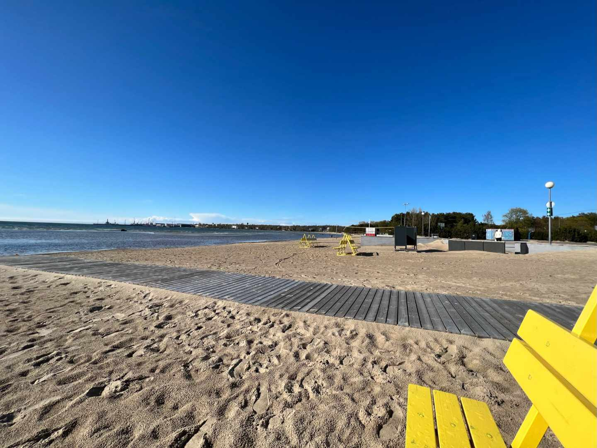

## Welcome to the Baltics

Yes, I chose Tallinn as the first destination as a digital nomad. Tallinn - the tiny capital many never heard of. I think it's one of the most underrated cities in Europe. 🇪🇺

Estonia is the country with the most digital government in Europe. Their ID cards provide digital access for signatures, voting, medical records and submitting tax claims. You can even start your first business digitally. But there are things you need to do in person: marriage, divorce and a credit for properties. 

*IT education is important in Estonia. All children start learning about algorithms and coding at the age of seven. It's preparation for the digital age.*

<figure>
	
	<figcaption></figcaption>
</figure>

Fun Fact: When you walk around the city, you'll notice the lokal coffeeshops "Reval". That's the original name of the city until 1918. The name changed to Tallinn with the independence of Estonia.

Reval was a significant trade hub in Europe during the 14th and 16th centuries. Today, the old town of Tallinn is one of the best-preserved medieval cities and is classified as a UNESCO World Heritage Site. You get a glimpse of the former medieval fortress.

Tallinn was occupied by the German until end of World War 1. Followed by the occupation by the Red Army during World War 2 in 1940. Nazi Germany occupied the city from 1941 to 1944. But Soviet occupation was quickly reestablished until 1991. Tallinn became the capital of an independent country once again in August 1991. 🎉

## Population

Tallinn experienced an extensive influx of Russian immigrants during the Soviet occupation (1944-1991). Whole new city districts were developed like Lasnamäe,T which became the most populous district of Tallinn in the 1980s. *Today, about 50 % of the inhabits speak Estonian and about 46 % speak Russian as their native language.*

<figure>
	
	<figcaption></figcaption>
</figure>

## Old Town

I was lucky to live in the middle of the city. My apartment was next to the town hall square. Many tourists arrive by ferry and bus for day trips. Consequently, the streets can get crowded. But the early mornings and late nights are comparatively quiet. 

<figure>
	
	<figcaption></figcaption>
</figure>

Interestingly, the Russian embassy was always guarded by at least one Estonian police car. Estonias do support the Ukrainians in the war. 🇺🇦

<figure>
	
	<figcaption>Posters in front of the Russian embassy</figcaption>
</figure>

Old Town felt like a car-free zone to me. There are just very little parking slots in the centre. There's no traffic lights for pedestrians between Old Town and Telliskivi. You can cross one of Tallinn main roads with an underpass. I did enjoy never stopping to get to work!

## Telliskivi

- rising tech and startup bubble
<figure>
	
	<figcaption></figcaption>
</figure>

### Coworking Space Lift99

<figure>
	
	<figcaption></figcaption>
</figure>

## Public Transport

- free public transport
- very affordable prices
- smart card
- qr ticket

## Vegan Community

<figure>
	
	<figcaption></figcaption>
</figure>

## Beach
-  It's pretty flat
<figure>
	
	<figcaption></figcaption>
</figure>

## Things to Do:

<figure>
	
	<figcaption></figcaption>
</figure>

<figure>
	
	<figcaption></figcaption>
</figure>

- Jägala-Wasserfall
- Nationalpark Lahemaa

- Estonian Open Air Museum 
- Kumu Art Museum
- Lennusadam Seaplane Harbour
- fotografiska
- KGB Museumsa