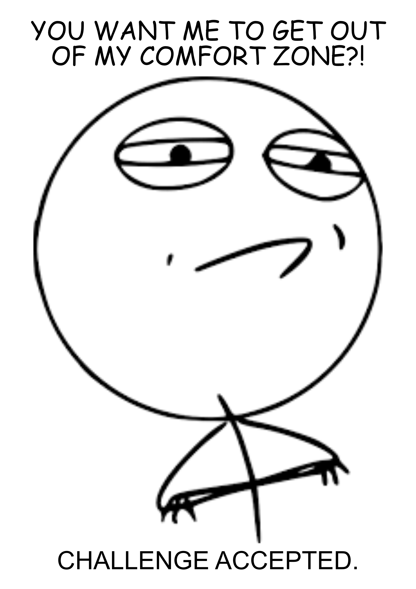
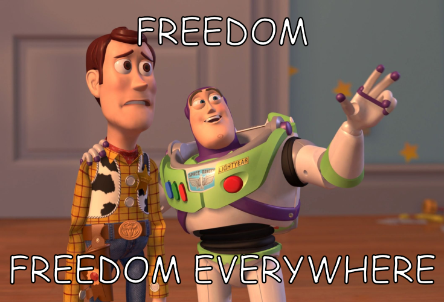
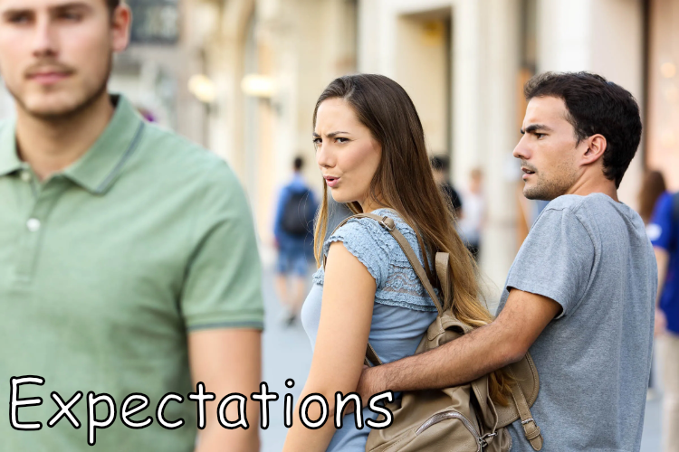

---
title: "Starting a Life as Digital Nomad"
author: "Toni Czyrnik"
date: 2022-05-02
publishDate: 2022-05-02
lastmod: 2022-05-02

draft: false
hidden: false

categories:
  - Digital Nomad
  - Personal
  - Student

keywords:
  - Digital Nomad
  - Student
  - Remote
  - Tallinn

summary: "Why should you leave your comfort zone? 🏃‍♂️"
---

Selling almost all your shit, renting Airbnbs for the upcoming months, saying goodbye to your social circle - sounds familiar? Leave your comfort zone, they said.

<figure>
    
    <figcaption>Get on with it!</figcaption>
</figure>

## Starting a Life as Digital Nomad

But why the heck should you leave everything behind and sell your shit? Simple. Flexibility, independence and the sense of adventure.

It is incredible, when you can call any place your home! But eventually, someone asks you for the first time: "Hey, what are you doing for a living?" 

That feels weird. How do you explain, what you're trying to accomplish right now? "I live out of a suitcase and do things on a computer remotely." That's right-on, but neither concrete nor creative. Going into detail on all the online adventures I'm having was not the ideal way to answer that question. 🙃

The next follow-up question "Where are you living?" becomes awkwardly difficult... 

<figure>
    
    <figcaption>Freedom!</figcaption>
</figure>

Being independent of a fixed location is a privileged lifestyle. You do not need to be a highly educated tech person for it, but it is advantageous being one. It's easy to stay within an English-speaking bubble. There is not much of a change. I do appreciate the privilege of being born into a high income country in the middle of Europe more than I used to! Let's see what the upcoming weeks will add to that!

## What am I expecting from the upcoming months?

I started to get rid of unnecessary possessions a couple of years ago. Ever since, I’ve been trying to own less and focus more on experiences. Going even more digital is the next step of my journey to [essentialism](https://en.wikipedia.org/wiki/Essentialism). I want to deepen my understanding of central things in life, at least in my own comprehension. Leaving your typical surroundings can be a great kick-start for exciting  changes! 🚀 

<figure>
    
    <figcaption>U Can't Touch This 🎵</figcaption>
</figure>

## Remote Student Life

Starting a digital lifestyle as a student is one of the best starting points. It's one of the most flexible periods in life, anyways. Getting to know new people feels easy and natural!

There are nearly no serious obstacles to overcome. Most of the study materials are available online. You need to find a table and an internet connection - that's a piece of cake! The Erasmus Student Network (ESN) is one of many ways to get to know new people. 

Unfortunately, exams still require attendance. So, there are some weeks in the year, which are bound to a specific location.

## Conclusion

I'm excited about the next weeks and months! Many new experiences, memories and friendships will be made. 