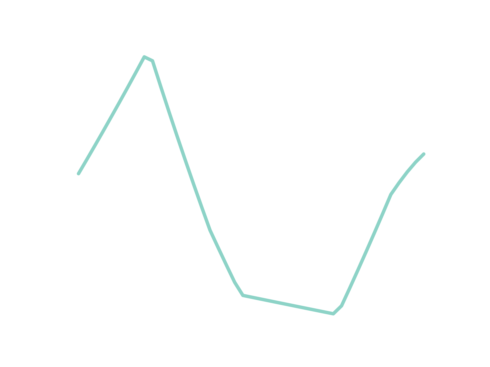
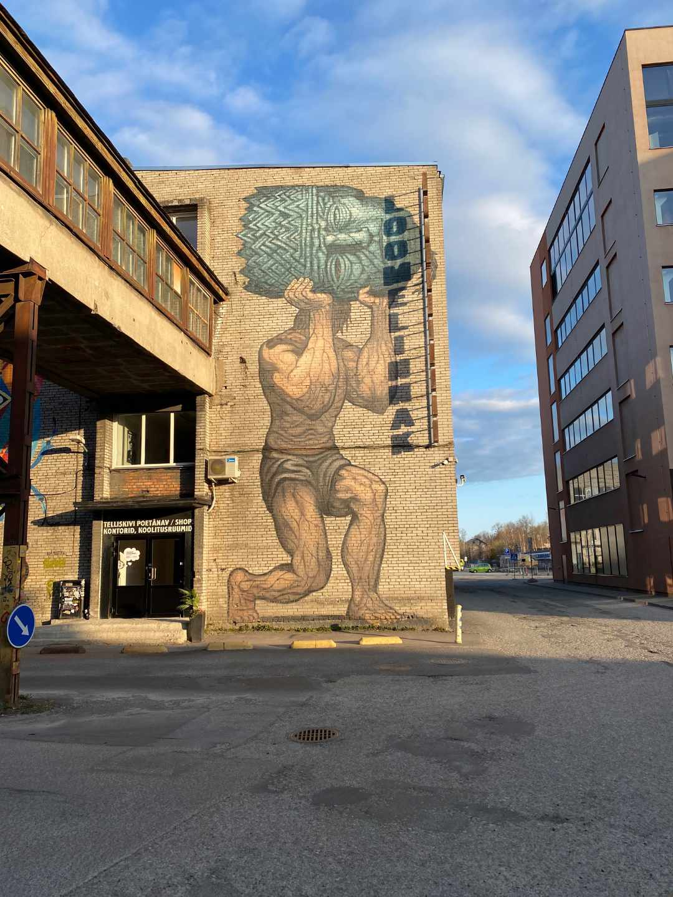
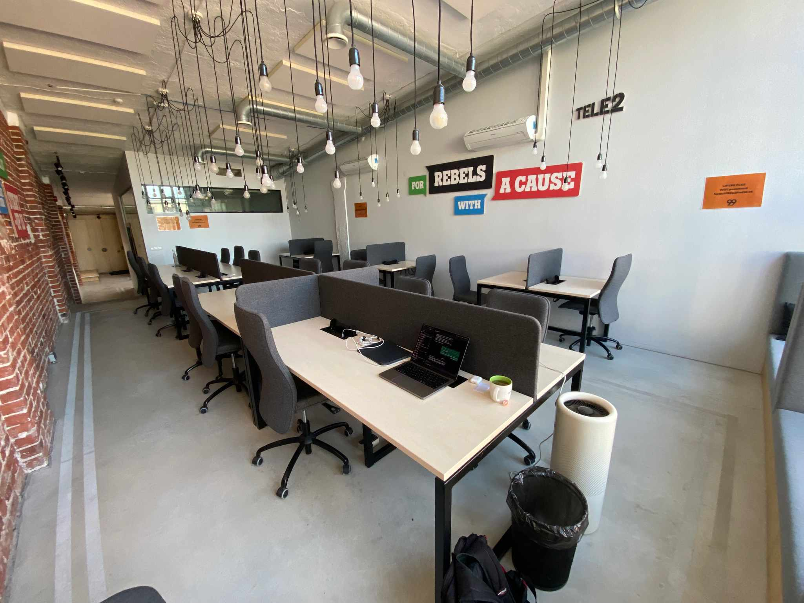
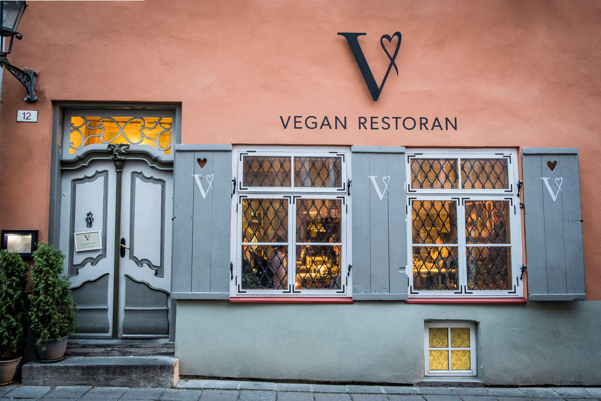
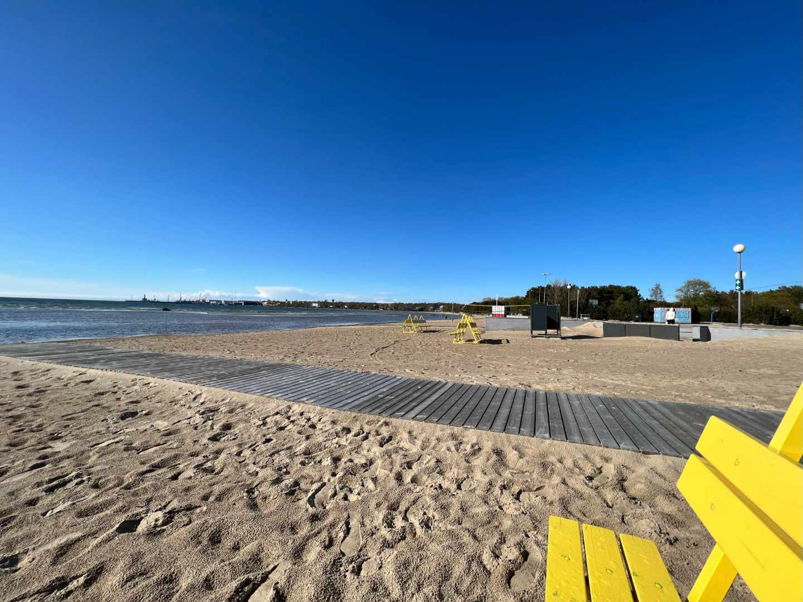
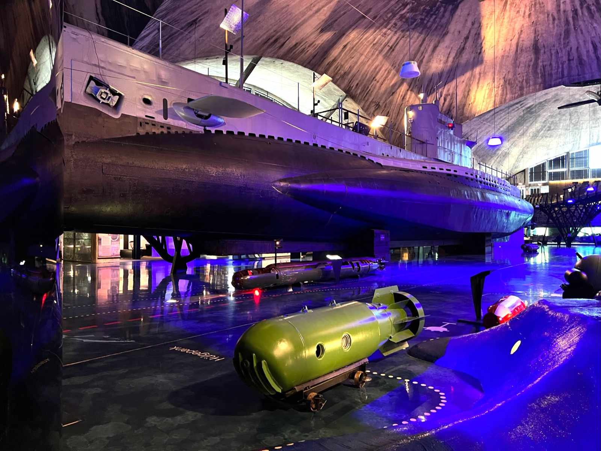

## Welcome to the Baltics

Yes, I chose Tallinn. Tallinn - the tiny capital that many never heard of. I think it's one of the most underrated cities in Europe. 🇪🇺

Estonia is the country with the most digital government in Europe. Your ID card provides digital access for everything like signatures, voting, medical recored and submitting tax claims - except for marriage, divorce and a credit for properties. You can even start your first business digitally. 

IT education is important in Estonia. All children start learning about algorithms and coding at the age of seven. It's for the preparation of the digital age. 

<figure>
	
	<figcaption></figcaption>
</figure>

“Reval was in official use in Estonia until 1918.”

“Tallinn Old Town is one of the best-preserved medieval cities in Europe and is listed as a UNESCO World Heritage Site.”

“medieval port became a significant trade hub, especially in the 14–16th centuries”

“On 24 February 1918, the Estonian Declaration of Independence was proclaimed in Reval (Tallinn). It was followed by Imperial German occupation until the end of World War I in November 1918, after which Tallinn became the capital of independent Estonia. During World War II, Estonia was first occupied by the Red Army and annexed into the USSR in 1940, then occupied by Nazi Germany from 1941 to 1944.”

ToDo: Map of Tallinn
—> Easy Day Trip to Helsinki with the ferry, around 40 Euros 

## Population 

<figure>
	
	<figcaption></figcaption>
</figure>

## City Center
I lived next to the oldest Cafe in the city. (Opened since 1864, Maiasmokk)
- Previously Called Reval
- A Medieval Fortress
- Old Town is UNESCO World Heritage site
<figure>
	
	<figcaption></figcaption>
</figure>

## Telliskivi
- rising tech and startup bubble
<figure>
	
	<figcaption></figcaption>
</figure>

### Coworking Space Lift99

<figure>
	
	<figcaption></figcaption>
</figure>

## Public Transport

- free public transport
- very affordable prices
- smart card
- qr ticket

## Vegan Community

<figure>
	
	<figcaption></figcaption>
</figure>

## Beach
-  It's pretty flat
<figure>
	
	<figcaption></figcaption>
</figure>

## Things to Do:

<figure>
	
	<figcaption></figcaption>
</figure>

<figure>
	
	<figcaption></figcaption>
</figure>

- Jägala-Wasserfall
- Nationalpark Lahemaa

- Estonian Open Air Museum 
- Kumu Art Museum
- Lennusadam Seaplane Harbour
- fotografiska
- KGB Museumsa