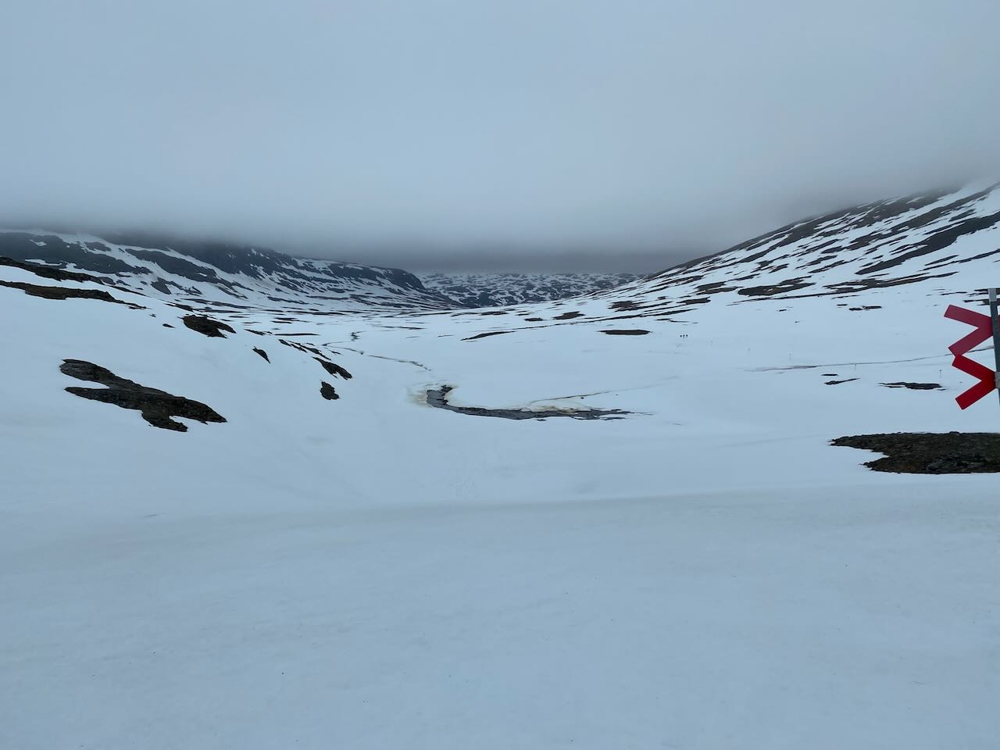

The Kungsleden, or "King's Trail", is a 400-km trek through Swedish Lapland that attracts hikers and outdoor enthusiasts from around the world. This trail offers a unique experience that combines breathtaking natural beauty, peaceful solitude, and the chance to immerse yourself in the rugged wilderness of the Arctic Circle both in summer and winter. There are STF-operated [mountain huts](https://www.swedishtouristassociation.com/stf-mountain-shops-shop-off-beaten-track/) every 10 to 20 km. You can buy your food and necessities in their stores. You need to find your trade-off between saving weight and spending more than usual. 🎒

<figure>
	
	<figcaption>Kungsleden Map</figcaption>
</figure>

I recently hiked Kungsleden from south to north and it was an unforgettable experience. My hike started in the small town of Kvikkjokk after a night in Luleå and an early train ride. I started in the middle of June, the beginning of the season. So I avoided the hordes of mosquitoes around Kvikkjokk. 🦟

<figure>
	
	<figcaption>Laitaure</figcaption>
</figure>

You are constantly rewarded with breathtaking views of mountains, crystal clear lakes and dense forests of pine and birch trees. The nature changes significantly during the hike. The south is dominated by a "sea of trees", while the north is characterized by rocks and clear views into the distance due to the higher elevation. 🏕️

<figure>
	
	<figcaption>View from the mountain Skierfe</figcaption>
</figure>

One of the highlights of the hike was reaching the top of Skierfe. You can see part of 
Sarek National Park from the top. It is the oldest national park in Europe and is known for its rugged and untamed landscapes. The park is home to a wide variety of wildlife, including reindeer, moose and a variety of bird species. 🏔️

The beauty of this view was incomparable. I will return to the Sarek in the future. This time, I just spend some time to enjoy the beauty of the north. 👀

<figure>
	
	<figcaption>Pass between Vakkotavare and Teusajaure</figcaption>
</figure>

 A great experience was camping in the remote wilderness. You are allowed to camp almost everywhere - stay away from buildings. 🏠
 
 It was difficult to find dry places because of all the snow melting in June. Once I found a spot for the night, I felt how disconnected I was from the outside world. 🌱
 
 The silence was broken only by the sounds of nature, such as the wind rustling through the trees and the occasional bird call. It was the perfect opportunity to reflect, recharge, and connect with the natural world. 🤫

<figure>
	
	<figcaption>Kaitumjaure</figcaption>
</figure>

As I continued north, I met other hikers from all over the world and we shared our experiences, stories, and the conditions ahead. This made the trip even more memorable. 🗣️

<figure>
	
	<figcaption>Camp after Tjäktja</figcaption>
</figure>

One of the most challenging parts was the mountain pass after Tjäktja. Fellow hikers told me that the pass opened two days before I arrived. There was so much snow! ❄️

Every few minutes I would break through the snow, not knowing what is underneath me. Sometimes you hear flowing water and hope the snow will hold. 🥶

Don't walk over blueish snow. That's a sign of a thin layer over running water. ⚠️

It was a rough experience, but eventually I made it to the top and was able to dry my feet. The shelter filled up quickly. But after an hour I left to reach the next place for the night. 🥾

<figure>
	
	<figcaption>Tjäktja Mountain Pass</figcaption>
</figure>

After about a week, I reached the end of the trail in Abisko, where I could take the train back to civilization and reflect on my journey. The Kungsleden had tested my physical and mental limits, but it gave me a sense of peace and accomplishment that I will always cherish. 🚀

## Itinerary Overview

- Day 1: 25 km, Kvikkjokk to Parte
- Day 2: 16 km, Parte to Aktse
- Day 3: 25 km, Aktse to Skierfe to Sitojaure
- Day 4: 16 km, Sitojaure to Saltoluokta
- Day 5: 20 km, Vakkotavare to Kaitumjaure
- Day 6: 22 km, Kaitumjaura to (almost) Sälka
- Day 7: 26 km, Sälka to (almost) Alesjaure
- Day 8: 35 km, Alesjaure to Abisko

Total: ~185 km

## Lake Crossings

One of the key features of the trail are the numerous lake crossings that provide scenic views. The crossings vary in difficulty and length, from short and easy to long and strenuous. The more challenging crossings require the use of boats. You can read more about [the boats in the mountains](https://www.swedishtouristassociation.com/boats-in-the-mountains/). 🚣

Do not underestimate the current & wind on the lake. ⚠️

*Please note that all boat traffic must be paid in cash.*

### Overview (South to North)

1) Lájtávrre: before Aktse Hut (about 1.5 km to 2 km)
- Rowing Boats available

2) Gasskajávrre: before Sitojaure Hut
- **No** Rowing Boats available
- Call to book your boat at the sign on the trek

3) Langas: after Saltoluokta Hut
- **No** Rowing Boats available
- *Buy your boat ticket online or in the reception!*

4) Teusajaure: before Teusajaure Hut (1 km)
- Rowing Boats available

## STF Membership

The Swedish Tourist Association (STF) operates and maintains the Kungsleden Trail, and [STF membership](https://www.swedishtouristassociation.com/join-stf/) is an option for those who wish to support the maintenance and preservation of the trail. STF members receive discounts on various activities and services related to the trail. 👏

## Conclusion

Hiking the Kungsleden from south to north was an amazing experience that I recommend to anyone looking for adventure and a chance to escape the hustle and bustle of everyday life. Whether you're an experienced hiker or looking to challenge yourself, the Kungsleden is a unique and unforgettable journey. 🤓