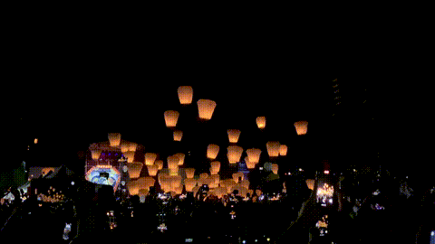
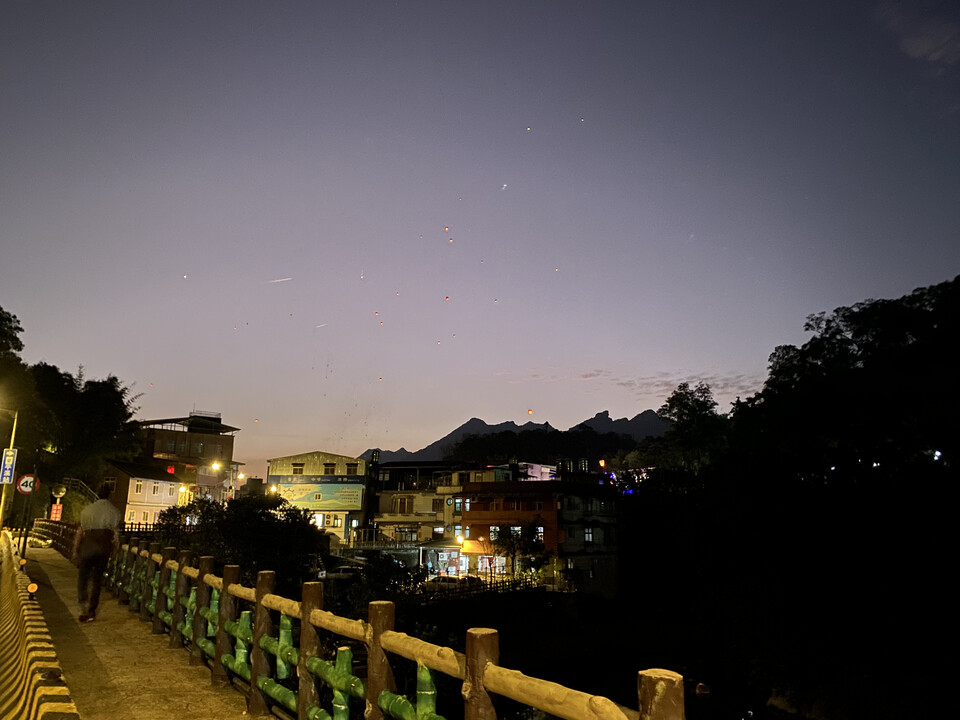
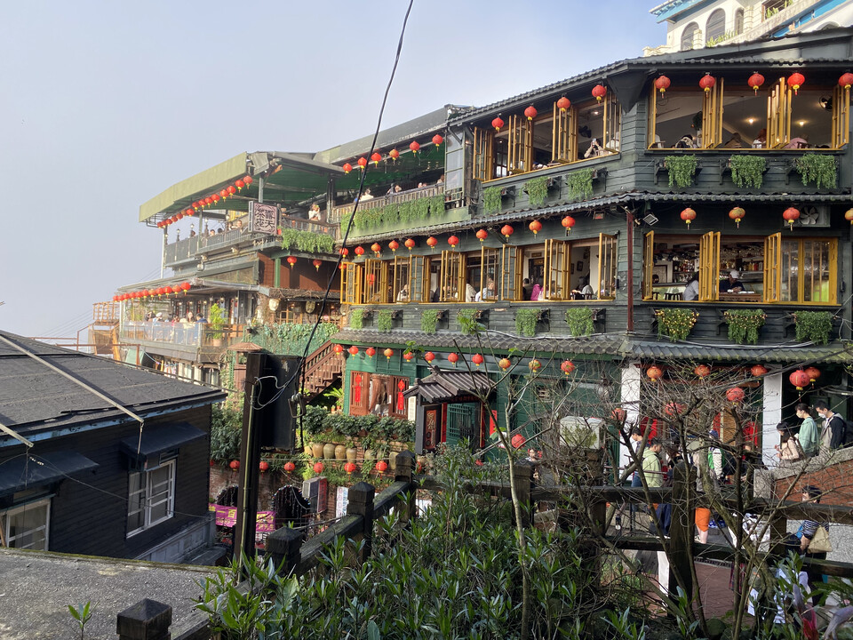

The Lantern Festival in Taiwan is an important traditional Chinese festival that marks the end of the Lunar New Year celebrations. It is a time when people gather to light and appreciate colorful lanterns, participate in various cultural activities, and enjoy performances and traditional food.

There are several places where you can watch the Lantern Festival. I combined the day with a trip to Jiufen and finished with the lantern festival in Pingxi. There's another town called Shifen nearby. I am told you can buy and release lanterns all year round next to the railway.

<figure>
	
	<figcaption>Start of the Lanterns in Pingxi</figcaption>
</figure>

## Pingxi Festival

The Pingxi Lantern Festival is a part of the larger Taipei Lantern Festival and takes place annually in the small town of Pingxi since 1999. It's the most famous celebration in Taiwan. The highlight of the festival is the release of sky lanterns, made of paper with a candle or fuel cell inside, which rise into the sky after participants write their wishes on them. People gather in groups and release their lanterns at the same time. The release of sky lanterns is a breathtaking sight, with the sky filled with floating lanterns of different colors and sizes. The festival attracts thousands of visitors each year. It is a celebration of local culture and a time for families and friends to come together.

<figure>
	
	<figcaption>Pingxi during Latern Festival</figcaption>
</figure>

### Jiufen

Jiufen is a historic mountain town. Once a prosperous gold mining town during the Japanese colonial period, it is now a popular tourist destination. The town is referred to as the "real-life version of Spirited Away", a reference to the Japanese animated film directed by Hayao Miyazaki. The movie's fantastical, labyrinthine setting is said to have been inspired by Jiufen's narrow streets and steep staircases, its traditional tea houses and street vendors. *(Hayao denies it.)*

<figure>
	
	<figcaption>Jiufen Teahouse</figcaption>
</figure>

In addition to its architecture, Jiufen is known for its stunning views of the Pacific Ocean and its vibrant night market. The night market offers local food, souvenirs, and street performances, while the town's old-world charm and modern amenities make it a unique travel experience.
