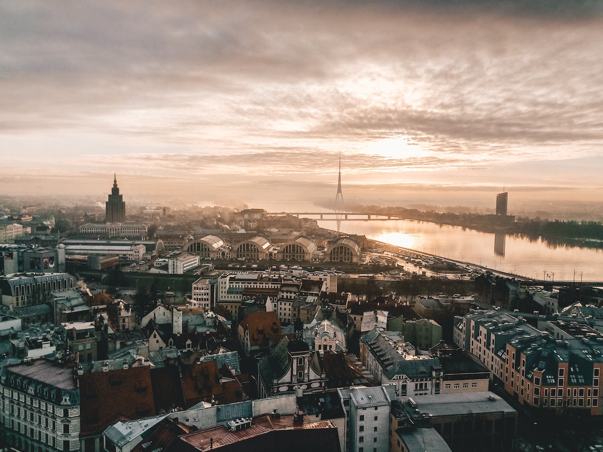

## Welcome to the Baltics - Riga Edition

It was an easy bus ride between Tallinn and Riga. My Airbnb was near the main railway station, a few minutes walk. Riga felt more chaotic than Tallinn for the first few minutes. There are more people, cars and buses. 🚎

<figure>
	
	<figcaption>Aerial Shot by Gilly</figcaption>
</figure>

### Old Town 

Riga's Old Town is a UNESCO World Heritage Site. The cobbled streets are lined with medieval buildings, many of which have been beautifully restored. 

<figure>
	
	<figcaption>Old Town Vibes by Jacques Bopp</figcaption>
</figure>

One of the main highlights of the Old Town is the Town Hall Square, which is home to the impressive Riga Town Hall. This Gothic-style building was built in the 14th century and now houses the Riga City Council. The Town Hall Square is surrounded by other notable buildings, such as the House of the Blackheads and the St. Peter's Church. You can take a guided tour of the Town Hall to learn more about its history and architecture. 

<figure>
	
	<figcaption>Town Hall Square by Martin Kleppe</figcaption>
</figure>

The St. Peter's Church is one of the largest medieval churches in the Baltic region. Built in the 13th century, it is a mixture of Gothic and Baroque styles. You can take a guided tour of the cathedral to learn more about its history and admire its impressive stained glass windows and frescoes. 🔔

<figure>
	
	<figcaption>St. Peter's Church by Artem Makarov</figcaption>
</figure>

The Old Town is a great place to explore on foot. You can stroll along the cobbled streets and admire the colorful buildings and street art. The Old Town is full of shops, cafes and restaurants where you can enjoy traditional Latvian food and drinks.

## Vegan Community

Riga has a thriving vegan community, with several restaurants and cafes catering to this lifestyle. Many of these places offer delicious and healthy food options, such as salads, smoothies, and raw desserts. 💚

<figure>
	
	<figcaption>Kozy Eats by Kozy Eats</figcaption>
</figure>

I think it is less common to be vegan in Riga. I cooked a lot during my stay. 👨‍🍳

## Population

After the collapse of the Soviet Union in 1991, Latvia regained its independence and began the process of transition to a market economy. This led to significant changes in the demographics of the city's population.

In the 1990s, Riga's population declined due to emigration, mainly of the Russian-speaking population. The city's population fell from around 900,000 in the early 1990s to around 700,000 in the late 1990s. This trend was driven by the economic and political instability in the country during this period and the desire of many Russian-speaking residents to return to their home country.

<figure>
	
	<figcaption>Population Trend in Riga</figcaption>
</figure>

The city's economy improved and more people moved to the city to work and study. EU accession in 2004 helped to attract more investment and business opportunities to Riga. Outside the city centre, many commercial spaces are unoccupied. Walking through the outer streets can sometimes feel sad. 

The streets are full of cars, even though the city has lost almost a third of its population. It's always busy in Riga.

## Public Transport

Riga has a well-developed public transport system that includes buses, trams and trolleybuses. Buses run frequently and can take you to most destinations in Riga. The tram system has several lines running through the city centre and suburbs. 

Public transport in Riga is affordable, with a one-way ticket costing around two euros (valid for one hour) and a day ticket costing around four euros (valid for 24 hours).

If you are travelling by train, you can use the official app (Pasažieru vilciens) to buy your tickets. The stations outside the city can be minimalist though. 😊

<figure>
	
	<figcaption>Train Station near the beach</figcaption>
</figure>

## Beach

Riga's beach is not the most popular among tourists, but it is worth a visit. The beach is located in Jurmala, a coastal town about 30 minutes from the city centre. 🚂

I enjoyed taking the train from Riga Central Station to one of the stops along the beach. Personally, time on the beach gives me an instant holiday feeling. 🤓

<figure>
	
	<figcaption>Beach near Riga</figcaption>
</figure>

The beach is long and wide, with fine white sand and clear blue water. There are many beach bars and restaurants serving delicious food and drinks. It is the perfect place to relax and enjoy the sun and sea. ☀️

<figure>
	
	<figcaption>Beach near Riga</figcaption>
</figure>

## Parks

Riga has several beautiful parks, perfect for a relaxing stroll or a picnic. The largest and most popular park is Mežaparks, located on the banks of the Daugava River. The park has a lake, a playground and several monuments. Another popular park is Esplanade Park, located in the heart of the city, with a music pavilion, fountain and several statues. The park is a great place to relax and enjoy the fresh air. There are many other small parks and gardens throughout the city, such as the Riga Botanical Garden and Ziedoņdārzs Park. 

<figure>
	
	<figcaption>Tourist Boat in Esplanade Park</figcaption>
</figure>

I used to go to the park on hot, sunny days. Combined with a light breeze, it's the perfect summer day in the city.

<figure>
	
	<figcaption>Esplanade Park</figcaption>
</figure>

## Conclusion

Riga is a beautiful and affordable city. My favorite place in Riga was the beach.I'd prefer Tallinn to Riga. Although Riga is the bigger city with more opportunities.🙃

<figure>
	
	<figcaption>Me in Riga, June 2022</figcaption>
</figure>