

Imagine a future where the vastness of the ocean becomes the fountain of our clean energy needs. Welcome to the cutting edge of seawater splitting — a revolutionary process poised to unlock an endless supply of hydrogen fuel. 
Dive with me into the deep blue as we explore how this remarkable technology could turn the tides on energy crises and solve the world's thirst for sustainable power! 🌊

<figure>
	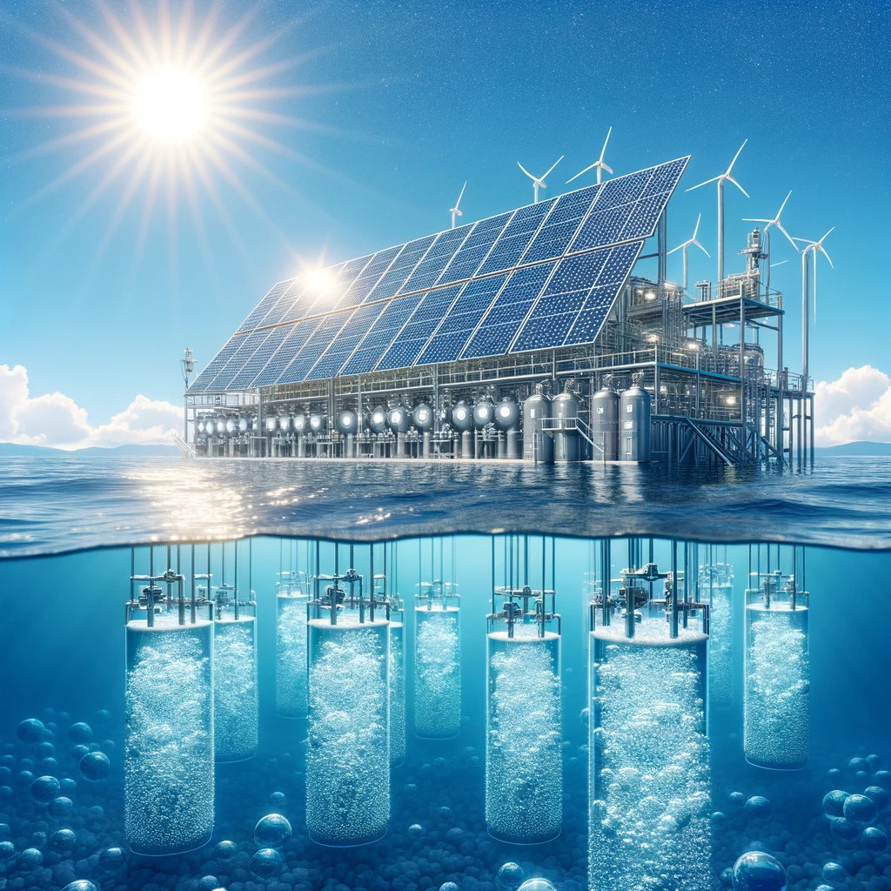
	<figcaption>Imaginary Offshore Hydrogen Production</figcaption>
</figure>

## Water Splitting

Seawater splitting *or seawater electrolysis*, is the process of separating water  \\(H_2O\\) into its elements, hydrogen \\(H_2\\) and oxygen \\(O_2\\), through the application of electrical energy. 
In our case, hydrogen is the element we are interested in.

<figure>
	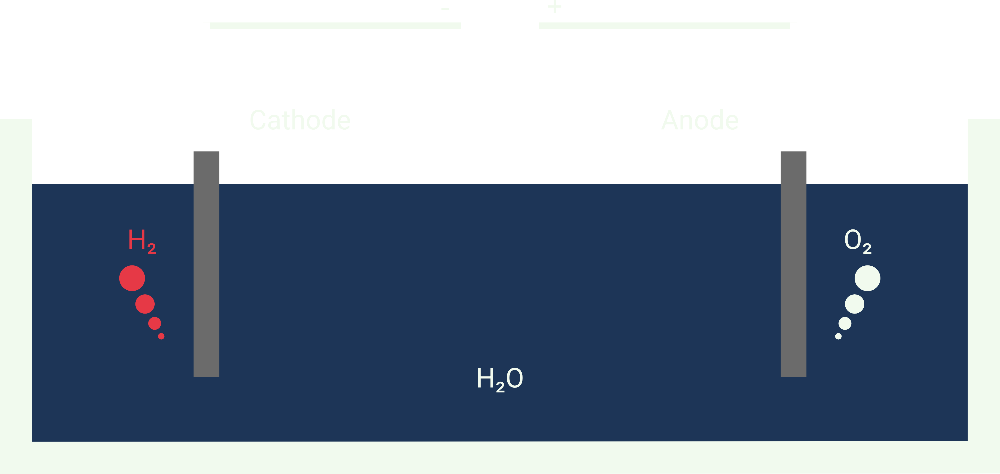
	<figcaption>Simple Setup for Water Splitting</figcaption>
</figure>

## The Problem with Freshwater: Earth's Water Distribution

About 96.5 % of earth's water is stored in its oceans as seawater. 
Additionally, there's about 1 % saline groundwater. 
A small fraction of about 2.5 % is freshwater.

The majority of freshwater is locked up in glaciers and ice caps, accounting for nearly 69 % of it. 
The remainder is groundwater (30 %) and surface freshwater like lakes and rivers (1 %). 

<figure>
	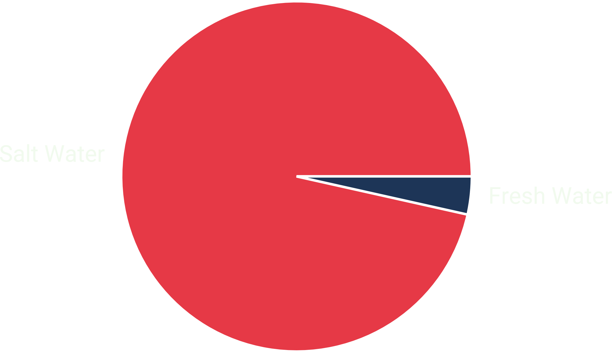
	<figcaption>Saltwater vs. Freshwater</figcaption>
</figure>

### Hydrogen in sun-rich & arid regions

The production of hydrogen through the electrolysis with freshwater poses a sustainability challenge in sun-rich but arid regions. 
The process could exacerbate water scarcity by diverting freshwater from human, agricultural, and ecological needs. 🌵

<figure>
	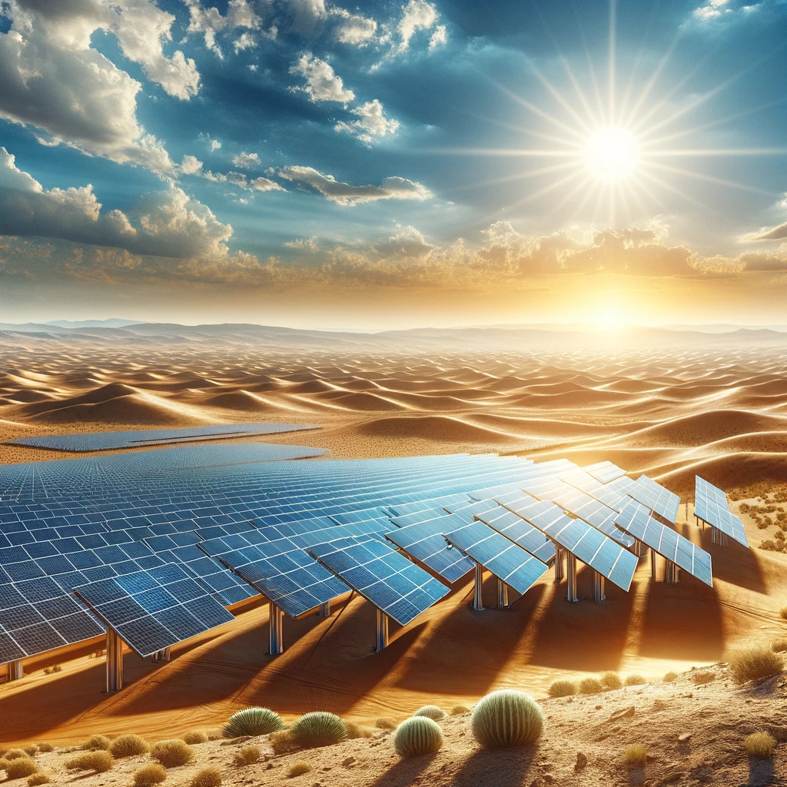
	<figcaption>Imaginary sun-rich region</figcaption>
</figure>

Innovations like direct seawater electrolysis and the use of treated wastewater are under research.
Integrating hydrogen production with desalination plants could offer an alternative, although it increases energy consumption and decrease efficiency.
Sustainable hydrogen production in these areas requires careful resource management and the development of technologies that minimize freshwater use.

## Composition of Seawater

Seawater's unique composition presents both opportunities and challenges for water splitting applications. 
The salts affect the durability and efficiency of electrolysis by catalyzing competing side reactions. 
Furthermore, these salts may react with the electrodes, creating deposits that can block the electrode surfaces and impede the reaction. 
Additionally, the pH of seawater (around 8) is lower than desired for current water splitting technologies, which can lowers the efficiency and output of hydrogen generation. [^1]

<figure>
	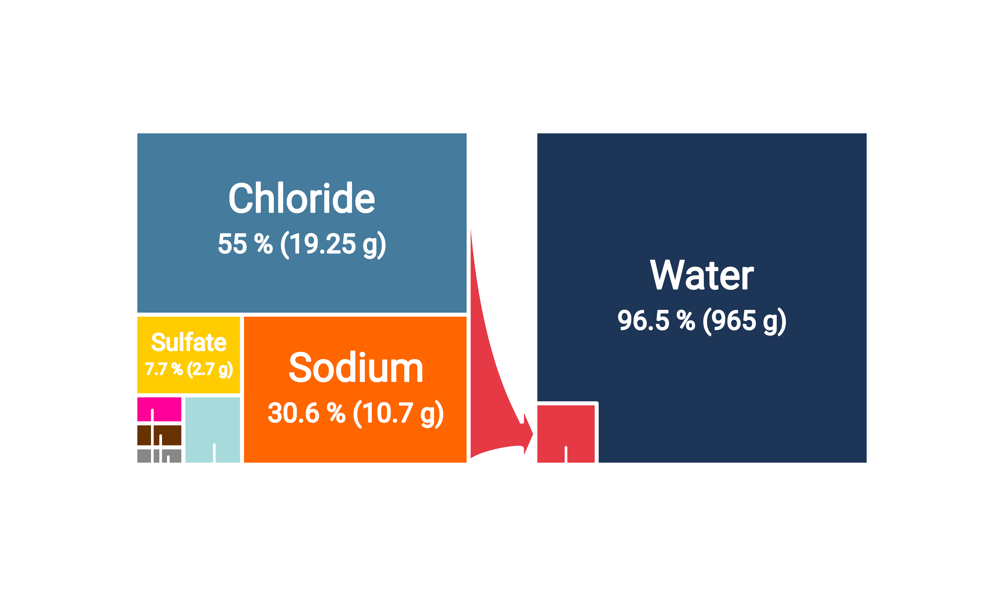
	<figcaption>Composition of Sea Water (Wikipedia)</figcaption>
</figure>

## Chemical Reactions: OER & ClER

The Oxygen Evolution Reaction (OER) and the Chlorine Evolution Reaction (ClER) are two competing electrochemical reactions that can occur during the electrolysis of chloride-containing solutions, such as seawater.

### OER

OER is the desirable half-reaction in the water-splitting process, where water molecules are oxidized to produce oxygen gas, protons, and electrons. 
The overall reaction at the anode can be represented as:

$$2 \mathrm{H}_2 \mathrm{O}(l) \rightarrow \mathrm{O}_2(g)+4 H^{+}(a q)+4 e^{-}$$

This reaction has a standard potential of +1.23 V versus the Normal Hydrogen Electrode (NHE). 
However, a higher potential is required due to kinetic overpotentials. 
Usually, an overpotential of +2.00 V versus NHE is prefereable.

### Chlorine Evolution Reaction (ClER)

In ClER, chloride ions \\(Cl-\\) are oxidized to form chlorine gas \\(Cl_2\\) at the anode. 
This reaction can occur in chloride-rich solutions like seawater and is represented by:

$$2 C l^{-}(a q) \rightarrow C l_2(g)+2 e^{-}$$

The standard potential for this reaction is +1.36 V versus NHE. 
ClER is kinetically favored in chloride-containing solutions compared to OER. [^1]

### Competition between OER and ClER

During the electrolysis of chloride-rich solutions like seawater, the Oxygen Evolution Reaction (OER) is challenged by the Chlorine Evolution Reaction (ClER). 
OER, which splits water to produce oxygen, is less energetically favorable and requires higher potentials than ClER, which generates chlorine gas from chloride ions and tends to occur more readily. [^1]

<figure>
	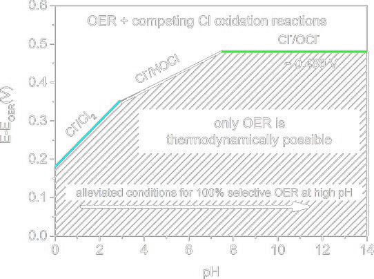
	<figcaption>Conditions for OER</figcaption>
</figure>

This rivalry not only lowers the efficiency of hydrogen production by favoring chlorine gas release but also risks contaminating the oxygen produced, degrading electrodes more quickly, and forming undesirable and potentially harmful chlorinated compounds. [^2]

## The problem with Chlorine

Preferring the Chlorine Evolution Reaction (ClER) during electrolysis not advisable due to several reasons tied to chlorine's production, demand, and associated costs.

Chlorine is a reactive and hazardous gas, which poses significant risks in handling and transportation.
Due to its dangers, chlorine is typically produced on-site where it is needed for industrial processes. 
According to the Eurochlor 2012 annual review, a small fraction (5-6%) of chlorine demand in Europe involves transportation.
Transporting chlorine, whether by road, rail, or pipeline, involves strict regulations, specialized equipment, and robust safety protocols to prevent leaks and exposure.

<figure>
	
	<figcaption>Chlorine is toxic.</figcaption>
</figure>

Consequently, from an economic and safety perspective, minimizing the production of chlorine through ClER in favor of the Oxygen Evolution Reaction (OER) during electrolysis is preferred. 
This approach aligns with the larger goal of sustainable and environmentally friendly hydrogen production, where the risks and costs associated with chlorine can be avoided.

## Solutions for Seawater Electrolysis

Ensuring the predominance of the Oxygen Evolution Reaction (OER) over the Chlorine Evolution Reaction (ClER) in seawater electrolysis can be achieved through strategies that exclude chlorine from the reaction. 
Employing electrocatalysts that lower the activation energy required for OER can make it more energetically competitive, reducing the window in which ClER can occur. 
Additionally, designing selective membrane systems or modifying the electrolyte composition to physically or chemically inhibit chlorine ions from reaching the anode can minimize or prevent the occurrence of ClER.

<figure>
	
	<figcaption>Imaginary town using renewable power</figcaption>
</figure>

### Option 1: Reducing the needed Overpotential with Electrocatalysts

The overpotential for the oxygen evolution reaction (OER) is a critical parameter when evaluating the efficiency of electrocatalysts used for water splitting. 
It is the extra voltage above the thermodynamic potential required to drive the OER at a certain current density. 
A lower overpotential indicates a more efficient electrocatalyst, as less energy is wasted in the form of heat and other losses like side reactions.

<figure>
	
	<figcaption>Reducing overpotential ensures OER.</figcaption>
</figure>

Research is looking for efficient catalysts with a high current density at low overpotentials. One research group finds Nitrogen-doped nickel molybdenum phosphide \\(N-NiMo_3P\\) as effective electrocatalysts for seawater splitting, showing lower overpotentials compared to commercial options and undoped counterparts. [^3]

\\(N-NiMo_3P\\) achieved an overpotential of 35 mV to reach a current density of 10 mA/cm² in seawater, outperforming commercial Pt/C which required 73.5 mV, and undoped \\(NiMo_3P\\) which required 73 mV under the same conditions. 
This performance is attributed to the nitrogen doping, which enhances the electrocatalytic activity by improving the catalyst's electrical conductivity and increasing the density of active sites for the oxygen evolution reaction (OER). [^3]

### Option 2: Protecting the Anode from Chlorine

Excluding chlorine from the anode reaction in seawater electrolysis can be achieved through anode coating and the use of selective membranes. Research and development in this area are ongoing to find cost-effective and durable solutions that can be applied on an industrial scale.

<figure>
	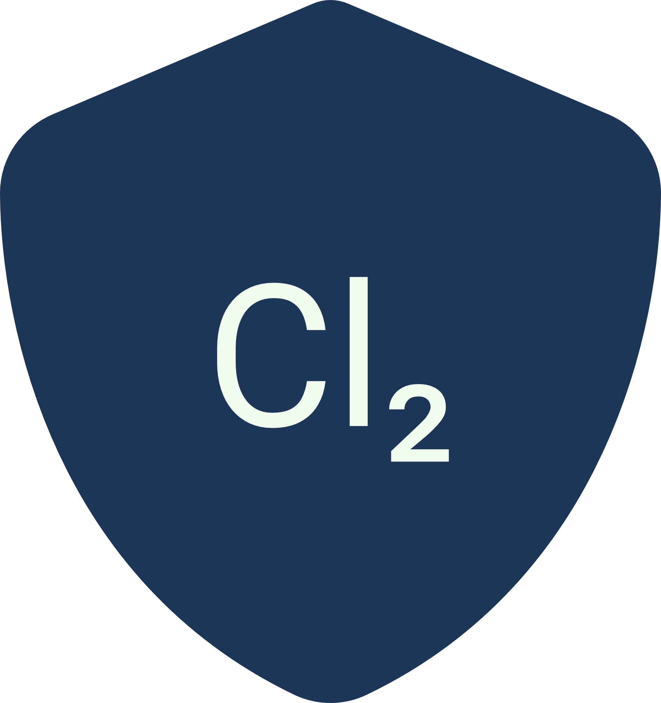
	<figcaption>Excluding chlorine from the reaction.</figcaption>
</figure>

#### Option 2.1: Anode Coatings

Anode coatings are designed to enhance the selectivity of the Oxygen Evolution Reaction (OER) while suppressing the Chlorine Evolution Reaction (ClER).
*The coatings can be applied through various techniques such as thermal decomposition, electroplating, or physical vapor deposition.*
*The thickness, morphology, and composition of the coating are critical parameters that determine its effectiveness.* 
The aim is to create a surface that has high catalytic activity for water oxidation but a low affinity for chloride ion adsorption, thus preventing chlorine gas production.

<figure>
	
	<figcaption>Repelling chlorine from the electrode</figcaption>
</figure>

##### Example: Direct seawater electrolysis by adjusting the local reaction environment of a catalyst

The paper discusses a method for direct seawater electrolysis for hydrogen production without the need for desalination, aiming to address the shortage of freshwater resources. Seawater must be desalinated before it can be used in proton exchange membrane (PEM) electrolysers. 

The research introduces an approach where a Lewis Acid Layer with the help of \\(Cr_2O_3\\) is added to the catalysts. This modification helps to dynamically split water molecules and capture hydroxyl anions, thus generating local alkalinity that improves the kinetics of electrode reactions, avoids chloride attack, and prevents precipitate formation on the electrodes. [^4]

<figure>
	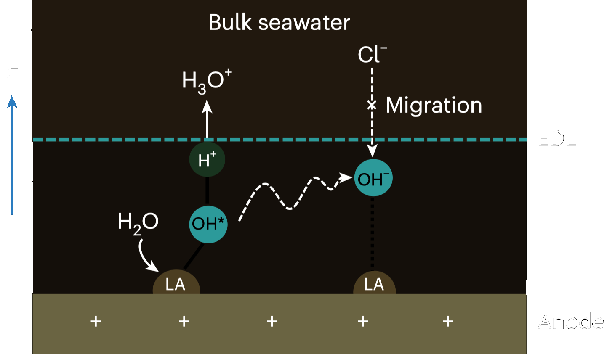
	<figcaption>Introducing a Lewis Acid Layer (LA) and an Electrical Double Layer (EDL)</figcaption>
</figure>

The result is a improvement in system stability and performance, with the electrolysis system reaching over 100 hours of stable operation at 500 mA/cm², and achieving industrially viable current densities at lower voltages, comparable to traditional PEM electrolysers that use purified water. This method circumvents the need for desalination and could potentially tap into the vast reserves of seawater, making it a promising solution for sustainable and large-scale hydrogen production. [^4]

#### Option 2.2: Selective Membranes
	
Selective membranes, such as ion-exchange membranes, are used to separate the anode and cathode compartments, allowing specific ions to pass through. In the case of seawater electrolysis, the membranes would permit the passage of positive ions (cations) and block negative ions (anions), including chloride ions, from reaching the anode. This separation is critical to avoid the formation of chlorine gas. These membranes are not only selective but also have to withstand the harsh oxidative environment at the anode during OER.

<figure>
	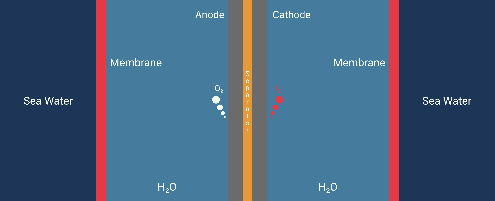
	<figcaption>Using a membrane to separate sea water</figcaption>
</figure>

##### Example: A membrane-based seawater electrolyser for hydrogen generation

This study proposes a direct seawater electrolysis method that overcomes the side-reaction and corrosion issues without the need for a pre-desalination process. The authors demonstrate a system that operated stably at a current density of 250 mA/cm² for over 3,200 hours under practical conditions without failure.

<figure>
	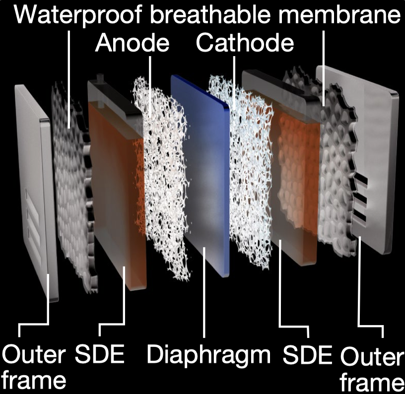
	<figcaption></figcaption>
</figure>

This system utilizes a hydrophobic porous polytetrafluoroethylene (PTFE)-based waterproof breathable membrane that acts as a critical gas-path interface. This membrane is designed to allow the selective diffusion of water vapor while blocking the passage of liquid seawater and its dissolved impurities, including ions. The use of the membrane facilitates an in situ water purification process, which is essential for the direct electrolysis of seawater. This process is based on a self-driven phase transition mechanism that converts seawater into pure water vapor through spontaneous evaporation, which then diffuses through the membrane. [^5]

<figure>
	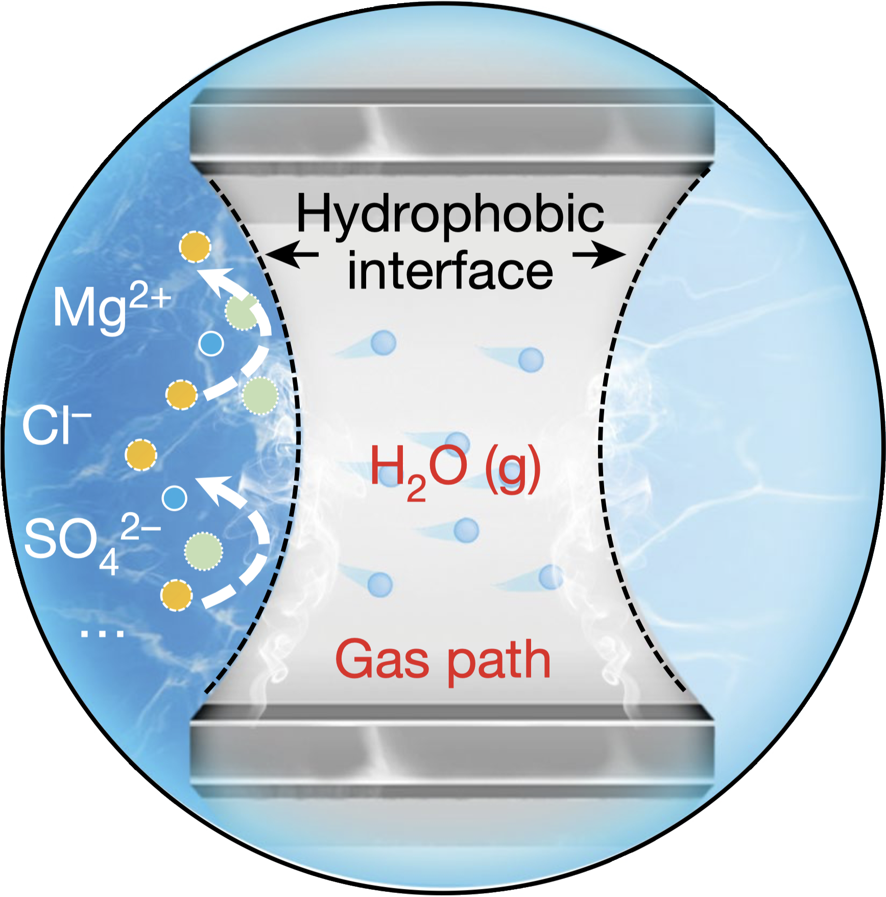
	<figcaption></figcaption>
</figure>

The Self-Dampening Electrolyte (SDE), a concentrated potassium hydroxide (KOH) solution, is another key component of the system. The SDE serves a dual purpose: it functions as the electrolytic medium in which electrolysis occurs, and it maintains the necessary pressure differential across the membrane. As water vapor transits through the membrane from the seawater side, it is absorbed and re-liquefied by the SDE on the other side. This mechanism ensures that pure water is continuously supplied to the electrolyser, thereby sustaining the electrolysis process without the need for external water sources or purification systems. [^5]

<figure>
	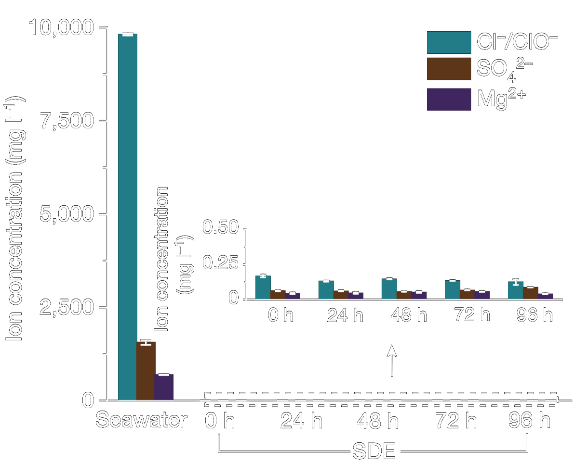
	<figcaption>Constant concentration in the SDE due to the PTFE-membrane</figcaption>
</figure>

This innovative setup achieves a new level of efficiency and sustainability in hydrogen production from seawater electrolysis. By establishing a thermodynamic equilibrium where the rate of water migration through the membrane matches the rate of electrolysis, the system maintains a consistent interface pressure difference. The result is a continuous and stable production of hydrogen, with the SDE playing a critical role in regulating the process. This method of direct seawater electrolysis eliminates the need for energy-intensive pre-desalination. [^5]

## Conclusion

Seawater splitting represents a promising frontier in the pursuit of sustainable hydrogen production. With current technology, it is indeed possible to carry out this process, and we are witnessing successful prototypes and operational models. However, the key to unlocking its full potential lies in scaling up these operations.

<figure>
	
	<figcaption>Give me seawater!</figcaption>
</figure>

The future is bright for seawater splitting as part of a global move towards cleaner energy sources. 🚀

## Sources

[^1]: Recent advances in electrocatalysts for seawater splitting
https://doi.org/10.1016/j.nanoms.2020.12.003

[^2]: Direct Electrolytic Splitting of Seawater: Opportunities and Challenges
https://doi.org/10.1002/cssc.201501581 

[^3]: Nitrogen-Doped Porous Nickel Molybdenum Phosphide Sheets for Efficient Seawater Splitting
https://doi.org/10.1002/smll.202207310

[^4]: Direct seawater electrolysis by adjusting the local reaction environment of a catalyst
https://doi.org/10.1038/s41560-023-01195-x

[^5]: A membrane-based seawater electrolyser for hydrogen generation
https://doi.org/10.1038/s41586-022-05379-5