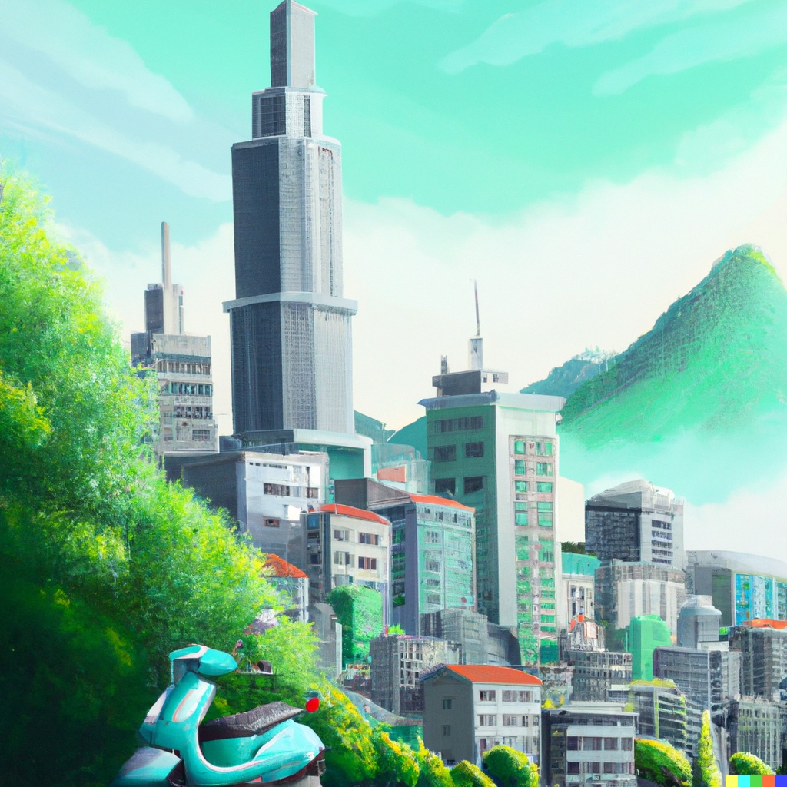
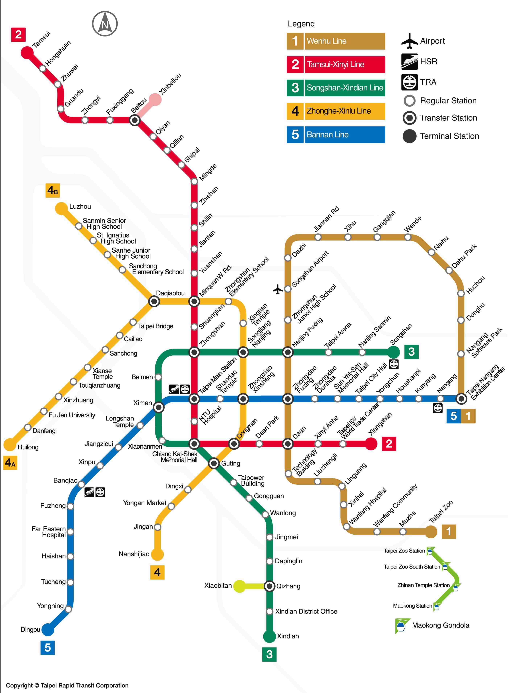
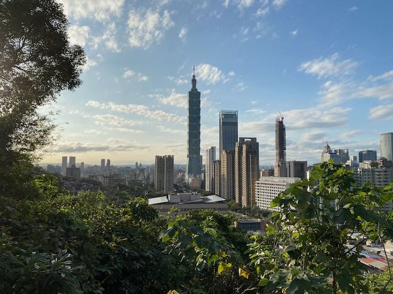
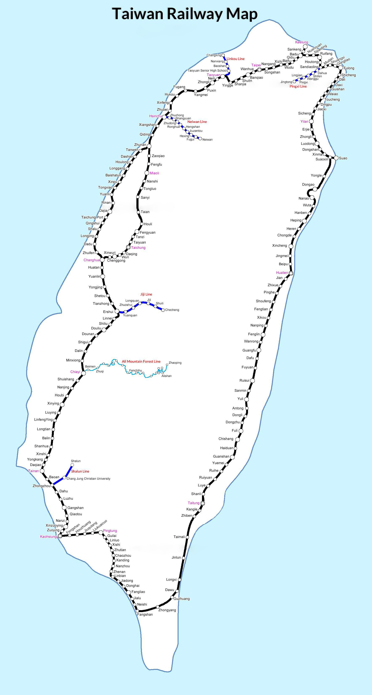

Taipei is the capital city of Taiwan, known for its unique blend of traditional Chinese culture and a modern, bustling metropolis. The city is located on the northern tip of the island and is home to more than 7 million people.

## History

Taiwan's history dates back to the late 17th century, when the island was inhabited by various indigenous tribes. Portuguese explorers named the island "Formosa" in the 16th century. In the late 1600s, the Dutch established a colony in the south of the island and the Spanish in the north. After seventeen years of war, the Dutch controlled much of the island. However, both colonial powers were eventually displaced by the Chinese, who claimed Taiwan as part of the Qing Dynasty (China).

<figure>
	
	<figcaption>Photo generated with DALL·E 2</figcaption>
</figure>

During the First Sino-Japanese War in the late 1800s, Taiwan was ceded to Japan, and the island became a Japanese colony. Under Japanese rule, Taiwan underwent significant modernization and was transformed into a center of commerce and industry. However, this period of colonization was marked by cultural suppression and political repression.

After World War II, Taiwan became an independent state under the rule of the Republic of China. In 1949, the Chinese Civil War ended with the defeat of the Nationalist Party, and the Communist People's Republic of China was established on the mainland. The Nationalists retreated to Taiwan, where they established a government-in-exile and ruled the island as the Republic of China (ROC).

<figure>
	
	<figcaption>caption</figcaption>
</figure>

During the second half of the 20th century, Taiwan underwent rapid economic development, becoming one of the "Four Asian Tigers" along with Hong Kong, South Korea, and Singapore. The island has become a major player in the global economy, and its thriving high-tech industry has earned it the nickname "Silicon Island".

Despite its economic success, Taiwan faces political challenges. The People's Republic of China considers Taiwan part of its territory, and the international community is divided on the issue. Nevertheless, Taiwan has developed a robust democracy and has become a thriving and dynamic nation with a rich cultural heritage and a bright future.

## Metro Taipei (MRT)

Taipei's subway system is one of the most efficient in the world. It covers most of the city and is an affordable and convenient way to get around. The lines of the subway are color-coded and easy to navigate, and all signs are in Taiwanese and English, making it a great option for tourists and locals alike. Do not eat or drink on the trains! ⚠️

<figure>
	
	<figcaption>Metro Map</figcaption>
</figure>

In addition to the Taipei Metro, the city offers bus and bike-sharing options for those looking for a more environmentally friendly way to travel. The bus network covers a wide area, providing connections to outlying areas and between metro lines.

## Economy

https://en.wikipedia.org/wiki/Taipei#Economy

## First days

There are many things to do and see in Taipei, from visiting the city's many museums and temples to shopping at its bustling night markets. Some of the best things to do in Taipei include exploring the city's famous shopping district of Ximending, visiting the iconic Taipei 101 skyscraper, and taking a trip to the nearby hot springs in Beitou.

<figure>
	
	<figcaption>Taipei 101</figcaption>
</figure>

### Jiufen

Jiufen is a historic mountain town. Once a prosperous gold mining town during the Japanese colonial period, it is now a popular tourist destination. The town is often referred to as the "real-life version of Spirited Away", a reference to the Japanese animated film directed by Hayao Miyazaki. The movie's fantastical, labyrinthine setting is said to have been inspired by Jiufen's narrow streets and steep staircases, as well as its traditional tea houses and street vendors. *(Hayao denies it.)*

<figure>
	
	<figcaption>Jiufen</figcaption>
</figure>

In addition to its architecture, Jiufen is known for its stunning views of the Pacific Ocean and its vibrant night market. The night market offers local food, souvenirs, and street performances, while the town's old-world charm and modern amenities make it a unique travel experience.

## Railway

<figure>
	
	<figcaption>Railway System in Taiwan</figcaption>
</figure>

*P.S. Don't forget to use both hands for anything of value, such as receipts and money! \
谢谢! (Xièxie, Thanks!)