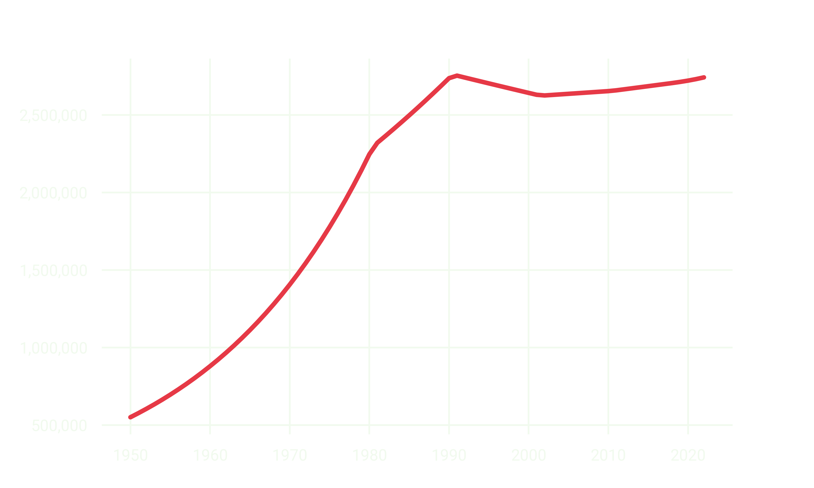
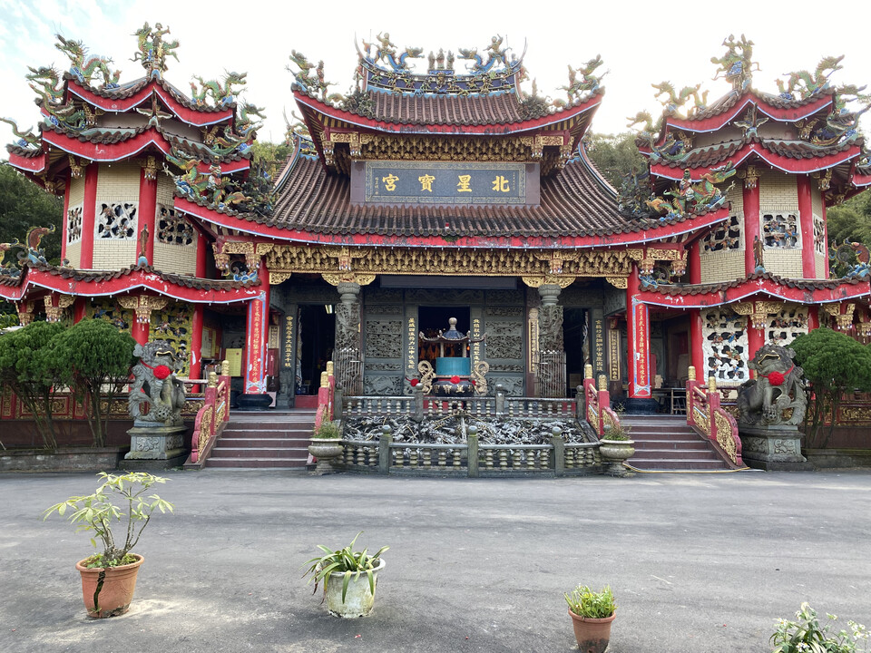
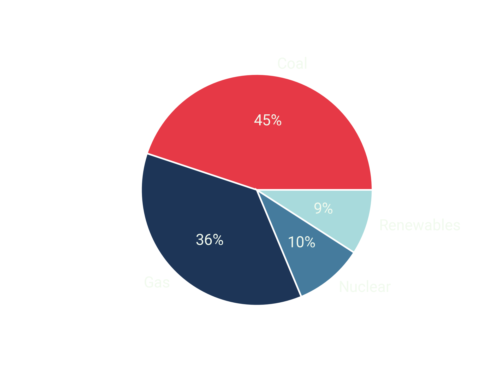
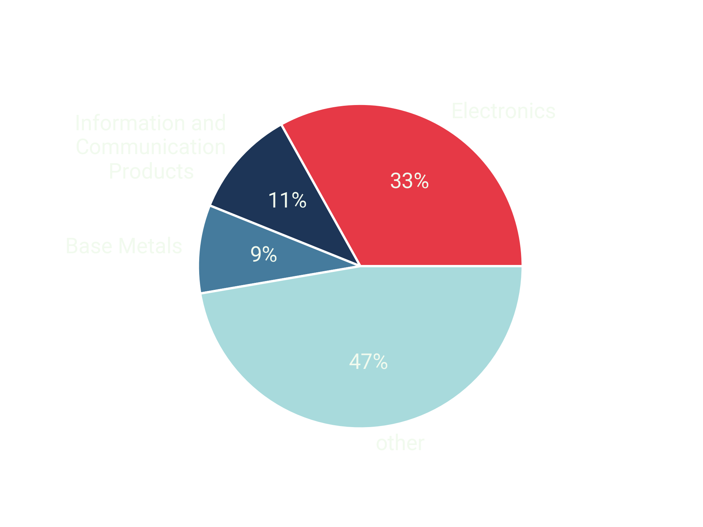

Taipei, the capital of Taiwan, is known for its unique blend of traditional Chinese culture and a modern, bustling metropolis. Located on the northern tip of the island, Taipei is home to more than 7 million people.

## My first days in Taipei

There are many things to do and see in Taipei, from visiting the city's many museums and temples to shopping at the busy night markets. Some of the best things to do in Taipei include exploring the city's famous Ximen shopping district, visiting the iconic Taipei 101 skyscraper, and taking a trip to the nearby Beitou hot springs.

<figure>
	
	<figcaption>Taipei 101</figcaption>
</figure>

## Metro Taipei (MRT)

Taipei's subway system is one of the most efficient in the world. The subway lines are color-coded and easy to navigate, and all signs are in Taiwanese and English, making it a great option for tourists and locals alike. 

<figure>
	
	<figcaption>Metro Map of Taipei</figcaption>
</figure>

In addition to the Taipei Metro, the city offers bus and bike-sharing (YouBike) options for those looking for a more environmentally friendly way to travel. The bus network covers a wide area, providing connections to outlying areas and between metro lines.

## Population Trend in Taipei

Taipei's population grew rapidly between the 1950s and 1990s, increasing fivefold!

Since then, population growth has begun to stagnate due to declining birth rates with a fertility rate of about 1.2 children per woman (2020), well below the replacement level of 2.1. The aging population has become a significant issue in Taiwan, with over 16% of the population aged 65 or older by 2020.

<figure>
	
	<figcaption>Population in Taipei</figcaption>
</figure>

As a result of these demographic changes, Taipei faces a number of social and economic challenges. The shrinking workforce is putting pressure on the pension system and causing labor shortages in some industries. The government is implementing various policies to address these issues, such as increasing support for elderly care and encouraging immigration to increase the labor force.

## History of Taiwan

Taiwan's history dates back to the late 17th century, when the island was inhabited by various indigenous tribes. Portuguese explorers named the island "Formosa" in the 16th century. In the late 1600s, the Dutch established a colony in the south of the island and the Spanish in the north. After seventeen years of war, the Dutch controlled most of the island. However, both colonial powers were eventually displaced by the Chinese, who claimed Taiwan as part of the Qing Dynasty.

<figure>
	
	<figcaption>Photo generated with DALL·E 2</figcaption>
</figure>

During the First Sino-Japanese War in the late 1800s, Taiwan was ceded to Japan, and the island became a Japanese colony. Under Japanese rule, Taiwan underwent significant modernization and was transformed into a center of commerce and industry. However, this period of colonization was marked by cultural suppression and political repression.

After World War II, Taiwan became an independent state under the rule of the Republic of China. In 1949, the Chinese Civil War ended with the defeat of the Nationalist Party, and the Communist People's Republic of China was established on the mainland. The Nationalists retreated to Taiwan, where they established a government-in-exile and ruled the island as the Republic of China (ROC).

<figure>
	
	<figcaption>Temple in outer Taipei</figcaption>
</figure>

During the second half of the 20th century, Taiwan underwent rapid economic development, becoming one of the "Four Asian Tigers" along with Hong Kong, South Korea, and Singapore. The island has become a major player in the global economy, and its thriving high-tech industry has earned it the nickname "Silicon Island".

Despite its economic success, Taiwan faces political challenges. The People's Republic of China (mainland China) considers Taiwan to be part of its territory, and the international community is divided on the issue. Nevertheless, Taiwan has developed a robust democracy and has become a thriving and dynamic nation with a rich cultural heritage and a bright future.

## Electricity and Energy Sources of Taiwan

Taiwan's electricity is generated from fossil fuels: coal and natural gas. In 2021, coal accounted for about 45% of the country's electricity generation, while natural gas accounted for 36%. Nuclear power accounted for about 10%, while renewable sources such as wind, solar, and hydro accounted for the remaining 9%.

<figure>
	
	<figcaption>Electricity Generation in Taiwan 2021 <a href="https://www.statista.com/statistics/1237635/taiwan-distribution-of-electricity-production-by-source/">(source)</a></figcaption>
</figure>

In recent years, Taiwan has taken steps to increase its use of renewable energy. The government has set a goal for renewable energy to account for 20% of the country's electricity generation by 2025. To achieve this, the government has implemented various policies and incentives to encourage the development of renewable energy, such as feed-in tariffs for solar and wind power.

## Economy of Taiwan

Taiwan's economy is known for its high-tech industries, such as semiconductors (TSMC), electronics, and information technology. Taiwan is dependent on trade, with exports accounting for about 70 percent of its GDP. The country is a member of the World Trade Organization and has free trade agreements with many countries. 

<figure>
	
	<figcaption>Export Goods of Taiwan <a href="https://tradingeconomics.com/taiwan/exports">(source)</a></figcaption>
</figure>

## Railway System of Taiwan

The Taiwan Railway System is a comprehensive rail transportation network covering the entire island of Taiwan. It consists of three main types of trains: local trains, express trains, and high-speed trains.

Local trains are the slowest and least expensive, stopping at all stations and serving short distances within a county or city. Express trains are faster and more expensive, stop at fewer stations, and offer more amenities such as more comfortable seats and dining cars. 

<figure>
	
	<figcaption>Local/Express Railway System in Taiwan <a href="https://www.travelchinaguide.com/images/map/train/taiwan-railway.jpg">(source)</a></figcaption>
</figure>

The THSRC is the fastest way to travel between major cities in Taiwan. The high-speed rail system, known as the Bullet Train, began service in 2007 and covers the 345-kilometer distance from Taipei to Kaohsiung in 90 minutes. Trains travel at speeds of up to 300 kilometers per hour. 🚅