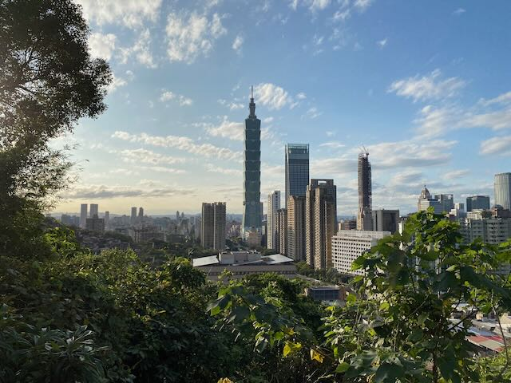
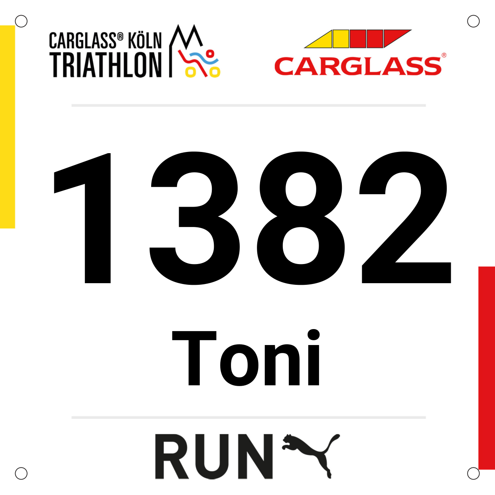

Update on February 7th, 2023 from Taipei, Taiwan. 🇹🇼

## Studying 📚

My exchange semester in Taiwan starts in mid-February. I'll be there for six months. 🤓 I'm looking forward to the cultural and academic change!

<figure>
	
	<figcaption>Taipei from Elephant Mountain</figcaption>
</figure>

## Work life 👨‍💻

My internship at Miele has been great. I hope to rejoin my team in August. ❤️

## IT4Kids 🧑‍🏫

We are working to accelerate the digital transformation of the German education system in primary schools. I am currently working on expanding our offices in Cologne and Ulm.

## Reading 🤓

I read a lot about aging and how to improve my lifestyle to extend my health span. I recommend the book "Lifespan" by David A. Sinclair.

## Fitness 💪

I have started training for my first triathlon. It will be difficult here in Taiwan, but there's a free gym on campus where I can use the stationary bike. Swimming is less than a euro per entry. 🏊‍♂️

Race day: 03.09.2023 in Cologne 🏁
<figure>
	
	<figcaption>My triathlon number</figcaption>
</figure>

## What's next? 🔮

From August I will be living in Aachen again and hopefully working for Miele in Gütersloh. I will continue to work on my aerobic base and my swimming skills.  🚀 

I would love to do another long distance hike. Maybe in Portugal? 🇵🇹

